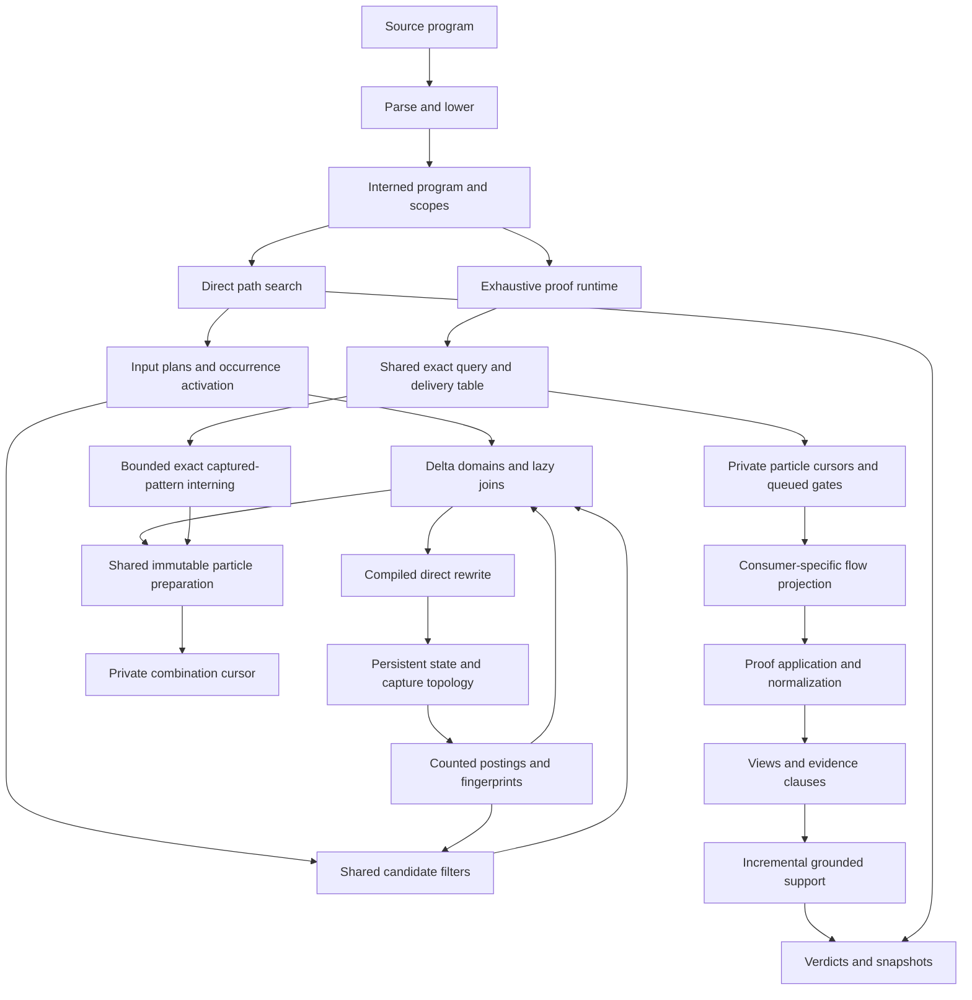

# Architecture state

Photonic is a proof language with a native Rust kernel, two execution modes, persistent state, indexed resource matching, and explicit proof provenance. The browser uses that Rust kernel through WebAssembly. The implementation now maintains candidate domains, reusable leaf bindings, capture reachability, and grounded proof support incrementally where their validity conditions allow it.

This report describes the source measured in [architecture.json](architecture.json), following baseline `437bda3`. Earlier algorithmic work and measurements remain in [optimization.md](optimization.md), [implementation.md](implementation.md), and [factorization.md](factorization.md). The [roadmap](roadmap.md) remains the record of larger unfinished work. No benchmark establishes a universal speedup or the absence of all kernel bugs.

The subsequent [joined-prefix audit](prefix.md) adds bounded multi-input prefix reuse and adaptive dispatch storage, with paired measurements against `20984f1`. Its matching ownership breakdown supersedes the single-file join description below. The subsequent [sharing audit](sharing.md) adds cross-plan prefix transcripts, constant-time symmetry comparisons, canonical environment reuse and shared identity flows; it records the preceding implementation. The subsequent [candidate-domain audit](candidate.md) adds shared exact presence filters, dependency summaries, and incremental candidate snapshots with independent query cursors; it records the preceding implementation. The subsequent [dispatch audit](dispatch.md) adds shared lexical-ancestry discovery, coherent availability maintenance, and detailed native phase measurements; it records the preceding implementation. The subsequent [partition audit](partition.md) adds bounded joined-prefix partitions that survive first-input occurrence changes; it records the preceding implementation. The subsequent [interior matching audit](interior.md) adds reverse dependencies below the first input, immutable unfinished snapshots, and a cheaper symmetry check; it records the preceding implementation. The [preparation audit](preparation.md) adds bounded immutable particle preparation reuse, private combination cursors, and occurrence-native candidate lookup; it records the preceding implementation. The [multilevel audit](hierarchy.md) adds projected context, bounded retained depths, explicit searched-domain invalidation and measured admission; it records the preceding implementation. The [capacity rejection audit](residual.md) avoids repeated allocation for impossible matches and redundant unique-term count checks; it records the preceding implementation. The [exhaustive preparation audit](exhaustive.md) adds bounded captured-pattern interning and preparation sharing beneath private proof consumers; it records the preceding implementation. The [batching audit](batch.md) adds exact bulk consumption of cached waiting spans with unchanged budgets, agenda rotation and synchronized firings; it is the latest implementation and performance report. The [CPU research review](research.md) evaluates what remains before GPU execution. The [parallelism audit](parallel.md) measures the existing executor and refreshes arithmetic profiling; it keeps the current execution default and records the GPU feasibility boundary.

## The graph model

There are several related graphs, with different identities and invariants:

| Structure | Meaning | Representation |
| --- | --- | --- |
| State incidence | A world groups resource occurrences; equal values can have distinct identity, and one resource can participate in several worlds | Persistent worlds, tokens, capture frames, and incidence graphs |
| Rule firing | A synchronized selection of input worlds/resources produces output worlds | Exact bindings, direct rewrite recipes, and proof applications |
| Match query | Input positions choose eligible worlds, then exact resource combinations; distinctness and symmetry constrain the product | Counted postings, candidate domains, particle matchers, lazy joins, and queued gates |
| Capture topology | Parent, lexical, and held-resource capture edges determine frame reachability | Incremental roots and a retained incoming-edge index with cyclic invalidation |
| Proof provenance | Resource/context mappings connect a historical source to a target and justify applications | Flows, views, events, and evidence sets |
| Grounded support | Every premise of a clause must be supported; alternative clauses can independently support its head | A directed AND/OR hypergraph maintained by missing-premise counters |

A rule firing and a conjunctive proof clause are naturally hyperedges. A single ordinary adjacency graph does not capture the entire semantics. In particular, independent reachability of each input does not establish a valid synchronized firing, and an ungrounded support cycle establishes no proof.

The runtime uses purpose-built indexes over these structures. No graph database is embedded. Replacing the indexes with a database would still require implementing exact occurrence identity, captures, multiplicity, evidence compatibility, resumable enumeration, and record limits at the language boundary.

## Execution and ownership



| Layer | Owner and entry point | Contract |
| --- | --- | --- |
| Frontend | `frontend/` | Parsing, lowering, and source representation; no scheduler policy |
| Program | `program.rs`, `catalog.rs`, `plan.rs` | Intern code and immutable descriptions; activate executable occurrences separately |
| Persistent storage | `sequence.rs`, `basis.rs`, `relation.rs`, `state.rs` | Share unchanged structure while retaining semantic resource identity |
| Lookup | `index.rs`, `index/posting.rs`, `position.rs` | Maintain counted postings and translate current ordinals to stable live sites |
| Candidate filtering | `candidate.rs`, `candidate/` | Share exact context-sensitive filters, summaries, and coherent candidate snapshots under a bounded budget |
| Particle preparation | `preparation.rs`, `preparation/`, `particle.rs`, `particle/` | Share immutable candidate data by exact fragment/world/capture identity; retain private selection and bounded admission |
| Direct matching | `dispatch/`, `joining.rs`, `particle.rs`, `factor.rs`, `replay.rs` | Emit exact bindings and cooperative progress without constructing proof evidence |
| Proof matching | `runtime/table.rs`, `selection.rs`, `selection/`, `search.rs`, `gate.rs` | Share exact queries and immutable captured preparation; retain private gates, independent delivery and proof projection |
| Construction | `rewrite.rs`, `recipe.rs`, `application.rs` | Apply a binding under an explicit source and capture context |
| Canonical identity | `fingerprint.rs`, `structure.rs`, `canonical.rs`, `runtime/normalization.rs` | Refine and check identity; fingerprints alone do not establish equality |
| Provenance | `flow.rs`, `runtime/application.rs` | Project and compose consumed, exact, read, and context dependencies |
| Grounded evidence | `proof.rs`, `support.rs` | Own unique clauses, lazy support initialization, and incremental propagation |
| Coordination | `path.rs`, `runtime.rs`, `agenda.rs`, `work.rs`, `executor.rs` | Schedule, suspend, enforce limits, and merge completed work |
| Inspection | `runtime/report.rs`, `snapshot.rs`, `prism.rs` | Read consistent evidence and expose reached, unreachable, or unknown |

The direct path mode searches operational traces. The exhaustive runtime also supports backward/source inference, flow projection, competing evidence, and proof closure. Their responsibilities remain distinct. They share storage and matching primitives, but the direct mode is not a substitute for the exhaustive proof semantics.

`proof::Store` now owns the clause collection and its support cache. The runtime supplies clauses and asks for status; it does not maintain the propagation graph itself. Matching subscription and normalization already have corresponding owners in `runtime/table.rs` and `runtime/normalization.rs`.

Both construction paths now take named request values: `rewrite::Request` and `application::Request`. This makes the source, rule/recipe, binding, ownership, and imported closure explicit at the call site. These remain internal requests from trusted matcher/projection paths; they are not public validators for arbitrary external bindings. Many internal identities still use `usize`. A complete migration to distinct frame/resource/site types is unfinished and should be measured at stable ownership boundaries.

## Reuse from abstraction to instance

| Level | Implemented reuse | Validity boundary |
| --- | --- | --- |
| Code | Interned complete rule values | Exact structural identity |
| Plan | Shared complete inputs and immutable particle fragments | Program and exact fragment identity |
| Context | Capture-free input sharing and capture-specific preparation | Required owner/capture context |
| Candidate | Counted postings, shared exact filters and dependency summaries, incremental candidate snapshots, and private occurrence projections | Frame, exact captured terms, and validated snapshot continuity |
| Leaf binding | Bounded factor caches for surviving candidate worlds | Same live occurrence, exact resource identity, and capture context |
| Joined fragment | Projected regions at adaptively retained depths, with reverse occurrence dependencies; immutable unfinished whole-prefix snapshots | Relevant inherited occurrences and surviving anchors; unchanged searched-domain intervals/order; independent playback and retraction before numeric site reuse |
| Whole query | Bounded direct replay on unchanged domains; shared exhaustive query table | Exact query dependencies and independent delivery cursors |
| Construction | Compiled recipes and normalization reuse for exact application identities | Source, binding, owner, rule, and captured environment |
| Grounded evidence | Established support plus unresolved premise dependencies | Append-only clauses within one exhaustive runtime |

Immutable descriptions are shared across abstractions. Live proof instances keep their own evidence and delivery. This implements part of the proposed top-down sharing hierarchy; it does not yet provide arbitrary common multi-particle plans, parameterized proof construction, or a global subsumptive query engine.

## Changes in this delivery

### Local candidate-domain updates

For a wider particle, candidate eligibility now queries the existing occurrence index instead of rescanning every token for every required term. Particles of at most 16 tokens retain the inexpensive direct scan. Eligibility remains a presence test: multiplicity is still checked by the exact preparation/matching layer, preserving the previous candidate domain and polling behavior.

Larger domains can skip an entire update when the changed worlds in their frame do not collectively contain every required symbol. This is a conservative exclusion: any inserted or removed matching world must contain every required symbol, so each must appear in the delta's affected-symbol set. A passing summary merely requests exact processing. Empty patterns remain sensitive to any changed world, and captures are checked by exact indexed terms.

Join storage accounting is now adjusted on actual member insertion and removal. Changing one domain no longer forces a scan of every surviving domain to recount particle storage and cached bindings. Removal still precedes insertion, so a reused numeric site cannot retain an old occurrence's factor.

### Incremental grounded proof support

Previously, each new evidence clause invalidated the entire support cache. Repeated verdict or snapshot requests rebuilt the fixed point over all accumulated clauses. A sequence of growing proofs with frequent inspection therefore repeated a substantial amount of work.

Support initialization remains lazy. Once requested, a new clause filters out already established premises. A clause with no missing premise establishes its head immediately. Otherwise the support network registers the clause against its missing premises. Establishing an atom visits its waiting clauses, decrements their counters, and propagates heads whose counters reach zero. Resolved slots are reused only after every registered premise has been processed; an empty dependency network is released.

The invariant is the least grounded fixed point of all stored clauses. Before an insertion, the cache is closed. Adding one clause can create new support only through its head and consequences of newly established atoms, which the worklist visits. Every establishment has a clause whose premises are established. Unsupported cycles remain waiting until an independent grounding derivation arrives. Duplicate clause insertion is ignored, and alternate evidence remains in the clause store even when its head is already supported.

This relies on evidence clauses being append-only within one runtime. Consuming an executable resource in a language state does not delete historical evidence. A future feature that retracts proof clauses would require a retraction algorithm or cache rebuild; it must not reuse this insertion-only interface for deletions.

The support network retains one waiting record per unresolved registered clause and links for missing premises, plus established atoms. Storage is linear in the evidence graph, not in the number of proof paths. Existing logical record accounting counts clauses; these derived adjacency/counter fields, like the earlier support calculation's metadata, do not add new semantic records or change reported limits. Logical records are not allocator-byte measurements.

## Preservation and validation

The changes preserve unordered state, synchronized firing, exact resource identity, multiplicity, capture ownership, executable reads, competing histories, and resumable enumeration. No arithmetic pattern is recognized specially. No syntax, saved frontend expectation, production limit, or scheduling contract was changed.

New checks cover indexed eligibility under capture changes and site reuse; empty, single-symbol, and conjunctive domains under partial enumeration and mutation; incremental storage totals; exhaustive small support systems against a simple fixed-point oracle; late grounding of cycles; support-slot recycling; and repeated observation versus a fresh execution at the same work boundary. Existing deep metaprogramming, dynamic occurrence production, recursive execution, and provenance tests remain active.

Acceptance passed `bazel test --nocache_test_results //language:test` and `bazel test -c opt --nocache_test_results //...`: all 106 test targets, including 137 runtime unit tests and browser/WebAssembly conformance. Rust formatting, Clippy, and Buildifier checks also passed. Linux/Windows execution, WebAssembly timing, and peak allocator bytes were not measured locally.

## Measurements

These sequential paired measurements use native `bazel run -c opt` against baseline `437bda3` (the full revision is in [architecture.json](architecture.json)). The Apple M5 Max was attached to AC power, with sleep prevented during measurements. Both revisions were prebuilt and used identical benchmark harnesses. Timings exclude parsing and initialization; the audit retains initialization measurements for the path cases. Each case uses at least 100 ms warmup, then seven inspection samples or nine path samples. Revision order alternates between cases. No tests or builds ran concurrently with the timings.

| Workload | Baseline median (ms) | Current median (ms) | Speedup |
| --- | ---: | ---: | ---: |
| Proof verdict after every requested step | 1988.572 | 5.479 | 362.92× |
| Proof verdict every 8 requested steps | 295.729 | 2.920 | 101.29× |
| Proof verdict every 64 requested steps | 39.180 | 2.595 | 15.10× |
| Proof verdict after one 40,000-step request | 3.198 | 2.674 | 1.20× |
| 4,096-candidate domain; 1,000 changes | 16.602 | 11.758 | 1.41× |
| 64 shared fragments; 256-token particle | 3.424 | 2.891 | 1.18× |
| 128-term match with 8,192 noise tokens | 150.976 | 150.131 | 1.01× |
| 256-term surviving factor; 1,000 changes | 3.520 | 3.461 | 1.02× |
| Six factors of two | 66.160 | 67.445 | 0.98× |
| 1234567890 + 9876543210 | 195.493 | 193.384 | 1.01× |
| 12345 × 67890 | 215.645 | 216.017 | 1.00× |

The proof-inspection case runs 32 ordinary chained declarations against the initially supported target `Stage0`. It requests a total of 40,000 work units in fixed chunks and checks the verdict after each call, including calls after the runtime has closed. Both revisions produce 33 states, 528 events, and 9,281 actual work units. The measured loop includes run and verdict calls; final report construction is excluded. The gain is avoided repeated support calculation during observation, not a reduction in derivations or an arithmetic special case.

All paired path event/work counts agree. All inspection state, event, work, retained-record, and peak-record counts agree. Arithmetic is effectively unchanged in this delivery; the six-factor sample is about 1.9% slower, while the repeated-fragment and domain workloads improve. These are workload-specific results.

Two paired runs of the 19-case exhaustive runtime suite use 25 samples per case. The median per-case speedups are 1.00× and 1.01×. Combining the paired ratios by case gives a range of 0.98×–1.05×, with a median of 1.01×. Every state, event, work, retained-record, and peak-record count agrees with the baseline. These small ordinary-runtime differences are distinct from the large frequent-inspection gain.

The earlier 110× reachability and 2.7× posting results in [factorization.md](factorization.md) describe that earlier delivery against its own baseline. They are not new whole-program gains and must not be multiplied by the numbers above.

Reproduce the new workloads:

```sh
bazel run -c opt //benchmark:inspection -- --length 32 --interval 1 --sample 7
bazel run -c opt //benchmark:inspection -- --length 32 --interval 64 --sample 7
bazel run -c opt //benchmark:domain -- --width 4096 --length 1000 --sample 9
bazel run -c opt //benchmark:runtime
```

## Remaining architecture work

| Work | Present boundary | Next acceptance requirement |
| --- | --- | --- |
| Shared multi-particle plans | Immutable particle fragments and exact whole-query sharing exist | Share a common join without merging consumer evidence, reordering delivery, or exploding discovery cost |
| Surviving joined prefixes | Projected single-depth and multilevel fragments survive compatible occurrence updates; shared whole prefixes retain independent consumers | Share retained partitions across plans and replace bounded transcript copies with persistent child links only if measured beneficial |
| Cross-plan candidate reuse | Shared domains and immutable preparation use exact weak fragment/world identity | Captured exhaustive preparation is now shared too; extend multi-input fragments only with private evidence and precise searched dependencies |
| Contextual construction | Exact application identities and recipes are reused | Fresh identity substitution and proof-preserving boundary maps for parameterized templates |
| Flow composition sharing | Persistent relations and local composition reuse exist | Reuse across compositions only under exact source/read/capture dependencies |
| Strong identity types | Current APIs distinguish responsibilities; many values remain integer indices | Introduce types where invalid interchange is possible without making hot representations larger |
| Further parallelism | Matching and normalization work can use the existing executor | Preserve deterministic observable progress, budgets, and synchronized semantics |
| Causal history reduction/fusion | Full required history remains represented | A language-specific observation-preservation argument before any production implementation |

The largest remaining algorithmic matching step is shared, delta-maintained multi-particle joins. The largest proof-construction opportunities remain flow and contextual rewrite reuse. These are unfinished engineering work. A terminal, universally optimal implementation is not established by the present benchmarks.

Structural generation of previously uncompiled rule shapes remains the [dynamic language proposal](dynamic.md). Deep matching of rules about rules and production of executable occurrences from compiled shapes are supported and tested; they should not be reported as runtime structural code construction.

## Build organization

Bazel is the build entry point. The repository pins Rust, LLVM, dependency lockfiles, WebAssembly tooling, and test tooling; lists sources explicitly; uses private visibility with declared consumers; and wraps executable/runfile composition with hermetic launchers. Native compilation, Rust checks, program fixtures, and WebAssembly conformance share the same source graph.

The frontend is a separate crate. The kernel remains one Rust crate with responsibility-oriented modules; file separation improves ownership but does not make each file an independent Bazel compilation unit. Further crate boundaries should follow stable dependency direction and measured rebuild costs. Splitting every graph component into its own crate would add API and build complexity without automatically improving execution or incremental compilation.

CI now uses the [public Buildkite pipeline](https://buildkite.com/vantle-labs/photonic) for Linux x86-64 build, formatting, lint, and test jobs. The hosted test configuration excludes the memory-heavy repeated ternary test; local full-suite acceptance includes it. The earlier six-platform matrix is no longer the current CI configuration. Local macOS and WebAssembly conformance does not establish remote platform success. See [automation.md](automation.md) and each implementation audit for validation scope.
