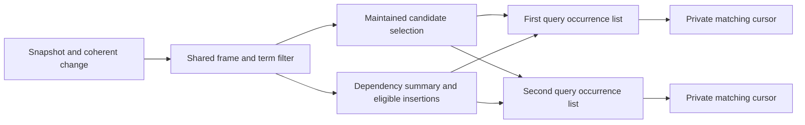

# Shared candidate domains

This delivery follows `19bf474` and extends the [sharing audit](sharing.md). The measured native source is identified by the file manifest in [candidate.json](candidate.json). It implements shared candidate filtering and incremental candidate snapshots across different direct-dispatch plans. The [roadmap](roadmap.md) tracks the remaining matching and proof work.

## Implemented boundary

A candidate filter answers whether a world contains every required term under the required capture and frame. Different input particles can share this presence filter even when they require different token multiplicities or list terms in different orders. Their exact particle matchers, input positions, occurrence lists, partial bindings, and delivery cursors remain individually owned.

The new `candidate::Store` belongs to one compiled program's dispatch network. It interns filters by frame and sorted, deduplicated exact terms. Captured rule terms include the capture frame. Program-local symbol identities are interpreted within that owning network; the store is not a cross-program cache.

Each node owns an immutable candidate selection, an immutable eligible-insertion selection, and a conservative dependency summary for one index snapshot. Subscribers share the summary and filtering work. A complete selection can be maintained through a consecutive snapshot change and then reused by a newly activated rule. Query-local member arrays still project these selections into separately owned mutable particle cursors; this delivery does not eliminate those arrays.



The owning components have distinct responsibilities:

| Component | Responsibility |
| --- | --- |
| `candidate/key.rs` | Exact filter identity, conservative dependency test, and indexed eligibility |
| `candidate/node.rs` | Snapshot validation, atomic cache transition, and subscriber reuse |
| `candidate/selection.rs` | Immutable selected sites and optional retention |
| `candidate/reservation.rs` | Reserve and release globally bounded acceleration records |
| `candidate.rs` | Bounded registry, named requests, discovery, and reclamation |
| `joining/space.rs` | Consumer occurrence lists, private particle cursors, subscription lifetime, and query accounting |
| `index.rs` | Stable live sites, current snapshot identity, and one predecessor token |

The subscription list is immutable and compact. Ordinary and shared domain updates compile from the same implementation with a constant strategy parameter, allowing ordinary queries to omit cache checks. Query construction borrows the store and retains a strong store handle only when the existing leaf/prefix factor path needs it. Registry lookup releases its lock before performing an uncached posting intersection; node locks serialize only consumers of that filter.

## Preservation argument

1. Canonicalizing the filter removes repeated presence predicates. Exact multiplicity and binding enumeration still use the original input pattern. Equal filter identity cannot merge token occurrences, consumer positions, or proof evidence.
2. A changed matching world contains every required symbol. If the changed worlds in the frame collectively lack any required symbol, the candidate set is unchanged. A passing summary requests exact filtering and never establishes a binding.
3. For a verified immediate predecessor, the new domain is the old domain with removed sites deleted, followed by matching inserted sites. Surviving world order and insertion order agree with the existing index traversal. Removal precedes insertion even when a numeric site is recycled.
4. The index keeps one predecessor identity without retaining a history chain. Different index histories, skipped snapshots, and missing cached selections trigger exact recomputation. Pointer identity is checked while the snapshot token remains owned, preventing allocator reuse from reviving an old cache entry.
5. Queries still remove their old members and particle cursors before adding replacements. They do not infer particle-cache validity from equal site numbers or a reused filter description. Join traversal, synchronization, pending steps, binding projection, and proof construction preserve their existing contracts.
6. A filter transition is completed under its node lock before a consumer receives it. The node can be used by separate index histories without exposing a mixed snapshot. Read-only consumers have independent cursors.
7. Admission failure returns the complete computed selection without retaining it. Cache eviction discards optional subscriptions and acceleration values. It does not shorten a candidate domain or discard a required continuation.

## Admission and accounting

Discovery is limited to input particles with more than one term in indexes containing more than 32 worlds. New nodes are admitted for candidate sets of 17 through 4095 sites, subject to the shared budget. Small and oversized domains use the existing direct lookup. A previously admitted domain can subsequently grow beyond that size; its complete result is still returned, with retention disabled when necessary.

Shared delta processing requires observed subscriber fanout. A lone query uses its existing local update path. After registry eviction, fanout detection can conservatively decline reuse and fall back to that path. A stale complete selection remains usable only after snapshot validation or exact recomputation.

Filter metadata and retained selections draw from the same 65,536-record network budget used by leaf and prefix acceleration. Each retained selection has a local cap of 4,096 logical units including its header. Registry entries with no consumer are reclaimable under admission pressure. Query subscription references are included in query accounting; selection storage and registry metadata are included once in the shared store's accounting. Reservations release when their owning allocation is dropped, including when a reader still holds an older snapshot.

These are logical record bounds, not allocator peak-byte measurements. Immutable index and plan descriptions are not copied into a cached proof history.

## Native measurement

Measurements use optimized native `bazel run` on an Apple M5 Max with AC power and `caffeinate -i`, against an isolated `19bf474` checkout. Three alternating paired rounds supply 27 execution samples per end-to-end case. Both checkouts are built before timed sampling; no competing build runs during measurement. The tables show pooled medians and the candidate's 10th–90th percentiles. Initialization is measured separately; source parsing is outside these timers.

The new benchmark runs 128 synchronized transitions with 256 background worlds. Distinct rules share one presence filter and have distinct unsatisfiable duplicate-token gates. This isolates shared-filter maintenance without introducing additional firings or a combinatorial output set. The activation variant produces gate tokens progressively, forcing queries to become eligible later. All compared event and logical-work counts agree.

| Workload | Before ms | After ms | Speedup | After p10–p90 ms |
| --- | ---: | ---: | ---: | ---: |
| 32 rules, 32 terms | 13.9212 | 10.2275 | 1.361× | 10.0509–10.4773 |
| 1 rule, 32 terms | 8.5528 | 8.7055 | 0.982× | 8.6053–8.9892 |
| 128 rules, 32 terms | 29.3332 | 14.3683 | 2.042× | 14.2300–14.8759 |
| 128 rules, 128 terms | 104.3541 | 43.4132 | 2.404× | 43.0638–44.3026 |
| 128 rules activated progressively | 23.8935 | 14.3652 | 1.663× | 14.1025–14.9984 |

Initialization speedups for these cases are 32 rules, 32 terms: 1.181×, 1 rule, 32 terms: 0.992×, 128 rules, 32 terms: 1.596×, 128 rules, 128 terms: 1.578×, 128 rules activated progressively: 0.989×.

| Workload | Before ms | After ms | Speedup | After p10–p90 ms |
| --- | ---: | ---: | ---: | ---: |
| Synchronized prefix, width 8 | 4.3649 | 4.4629 | 0.978× | 4.3861–4.5669 |
| Prefix changes each transition | 4.8191 | 4.9118 | 0.981× | 4.8495–5.0045 |
| Six factors of 2 | 65.6582 | 67.5900 | 0.971× | 66.2367–68.7596 |
| Decimal 1234567890 + 9876543210 | 197.8410 | 202.0178 | 0.979× | 200.9881–204.6407 |
| Decimal 12345 × 67890 | 218.2639 | 224.5684 | 0.972× | 222.9870–229.0655 |
| Leaf factor, width 256 | 3.4349 | 3.4380 | 0.999× | 3.3489–3.4710 |
| Local domain, width 4096 | 12.0289 | 12.3049 | 0.978× | 12.0500–12.5260 |

The matching component checks retain their original work and binding counts:

| Workload | Before ms | After ms | Speedup | After p10–p90 ms |
| --- | ---: | ---: | ---: | ---: |
| Repeated join, width 4 | 0.0350 | 0.0353 | 0.991× | 0.0345–0.0477 |
| Changing prefix, width 4 | 0.1006 | 0.0979 | 1.028× | 0.0951–0.1034 |
| Repeated join, width 8 | 0.3998 | 0.4123 | 0.970× | 0.3954–0.4412 |
| Changing prefix, width 8 | 1.4809 | 1.4943 | 0.991× | 1.4679–1.5523 |
| Repeated join, width 12 | 9.0883 | 8.2599 | 1.100× | 8.1906–8.4544 |
| Changing prefix, width 12 | 32.7700 | 32.6448 | 1.004× | 32.4868–33.2537 |
| Private prefixes, width 4 | 0.0506 | 0.0521 | 0.972× | 0.0505–0.0555 |
| Shared prefixes, width 4 | 0.0065 | 0.0063 | 1.033× | 0.0062–0.0067 |
| Private prefixes, width 8 | 0.8221 | 0.8394 | 0.979× | 0.8106–0.8674 |
| Shared prefixes, width 8 | 0.1531 | 0.1499 | 1.021× | 0.1461–0.1562 |
| Private prefixes, width 12 | 16.6153 | 16.7818 | 0.990× | 16.6301–16.9593 |
| Shared prefixes, width 12 | 3.6180 | 3.3545 | 1.079× | 3.3085–3.4516 |

For the 19 exhaustive fixtures, state, event, work, record, and peak logical-record counts are identical. The uninstrumented fixture run has a median per-case speedup of 1.000×, ranging from 0.971× to 1.032×. The instrumented fixture run has a median per-case speedup of 0.988×, ranging from 0.957× to 1.057×.

The improvement is concentrated in shared filtering. Arithmetic and several small matching cases retain a few percent of overhead; these measurements do not demonstrate an arithmetic speedup. The full raw sample set records dispersion and slower cases. Native Linux/Windows execution, browser performance timing, and allocator peak-byte measurements were not performed locally.

Reproduce the primary cases with:

```sh
bazel run -c opt //benchmark:candidate -- --sample 9
bazel run -c opt //benchmark:candidate -- --count 1 --sample 9
bazel run -c opt //benchmark:candidate -- --count 128 --sample 9
bazel run -c opt //benchmark:candidate -- --term 128 --count 128 --sample 9
bazel run -c opt //benchmark:candidate -- --activation --count 128 --sample 9
```

For the baseline, check out `19bf474` separately and copy only `benchmark/candidate.rs` and its Bazel target from this delivery. Its evaluator and all production source remain unchanged. The raw audit records the baseline harness hashes, exact candidate source manifest, configuration, case arguments, logical results, and samples.

## Verification

- `bazel test //language:test`: **158/158 kernel tests passed** in the debug configuration.
- `bazel test -c opt --nocache_test_results //...`: **106/106 test targets passed**, including the optimized kernel, native fixtures, and Rust/WASM conformance.
- Hermetic rustfmt, Clippy, and buildifier checks passed through the Bazel aspects.
- Three paired benchmark rounds preserve all compared event, work, binding, state, record, and peak logical-record counts.

The new tests compare candidate selections against a direct world/token scan and compare every planned join `Poll` against raw traversal. They cover canonical term permutations, differing multiplicities, independent cursors, partial consumption, simultaneous removal/insertion, numeric site reuse, late subscribers, irrelevant changes, skipped snapshots, different histories, captured equal code in different frames, cache eviction, concurrent readers, reservation exhaustion while an older selection remains live, oversized insertion batches, empty domains, and repopulation after a cached negative result.

Existing semantic expectations were not changed. The full suite includes nested metaprogramming, runtime production of compiled rule occurrences, competing proof histories, cyclic support, resource limits, and native/browser conformance. Structural construction of previously uncompiled rule shapes remains the separate proposal in [dynamic.md](dynamic.md).

## Remaining work

This completes the candidate-filter vertical slice: shared exact membership computation, shared dependency summaries, coherent incremental snapshots, independent consumer state, bounded retention, and native/browser integration.

Individual joined-result insertion and retraction, reverse dependencies from occurrences to partial bindings, and shared incomplete prefix frontiers remain the next major algorithmic work. Candidate membership is shared computation; query-local occurrence arrays and prepared particle cursors are still duplicated. General internal join fragments and the exhaustive proof matcher need their own integration and equivalence gates.

General contextual rewrite templates, nonidentity flow composition reuse, and dispatch progress batching also remain. Causal-history reduction, instruction fusion, and additional parallel mutation are conditional research tracks with separate observation-preservation obligations. This audit does not establish a globally optimal evaluator or a universal speedup.
