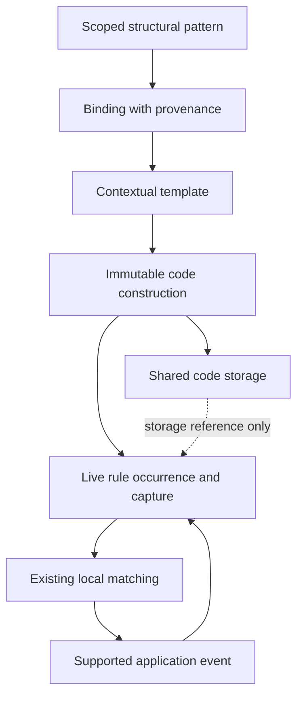
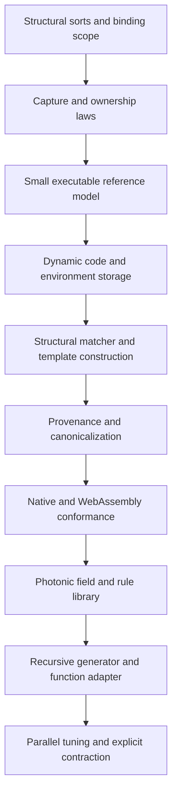

# Dynamic rule construction

Photonic should support finite programs that construct unbounded families of finite rule structures. The recommended extension is **structural matching and construction over contextual rule values**, with explicit scoped bindings, immutable code storage, and local executable occurrences. A runtime-wide mutable set of active rules would conflict with the language's existing treatment of provenance and alternative histories.

This is a design proposal, not implemented syntax or a correctness proof. The implementation baseline is commit [82e15d9](https://github.com/Vantle/photonic/commit/82e15d9). The literature includes foundational work and developments published through 2026; publication dates, rather than search-engine crawl dates, identify the sources below. The recommendation is a synthesis for Photonic, not a claim that one published calculus already provides its semantics.

The [structural reference model](model.md) now implements typed fragments, contextual inspection/reconstruction, scoped bindings, templates, resumable template traversal, staged generator factories with future binder declarations, concrete application with fresh declaration binding and an explicit restricted history compatibility model. Checked introduction validates live read witnesses; replayed paths and independent flow composition now support checked projection of exact sources, broader footprints and executable reads. It is independently Bazel-tested and does not add production syntax. Projected application now rewrites the source with scoped consumption and capture-graph import. Forty-three native comparison cases cover restricted ground behavior, binding evidence, scalar/scoped flow, escaped local execution and nested inference. Inferred steps retain complete auxiliary paths; historical introduction now accepts explicit prior-world witnesses along the checked ancestry. Held-identity convergence additionally has reference and native primitive regressions. Archival restoration now reconstructs captured graphs with explicit origin maps and preserves sharing across reclamation. Checked paths now transport archival origins through inferred projection, and held reads require an explicit historical owning world. Qualified support lookup now resolves nested auxiliary witnesses without conflating their local identities. Qualified fragment composition now preserves proof anchors and captures inside deferred declarations. Executable qualified publication now materializes captured graphs, retains inferred import origins and preserves distinct private declarations and shared resources through reclamation and projection. Qualified template/generator integration, the general structural law, grounded support, resumable quotation and native structural integration remain queued in the [roadmap](roadmap.md).

## Design criteria

An elegant extension should explain several capabilities with the same operations: constructing a field from unknown values, inspecting an unknown rule, adapting that rule to an interface, recursively building larger code, and deliberately replacing code with a smaller representation. These operations must preserve association, multiplicity, lexical capture, resource identity, and the distinction between jointly available evidence and competing histories.

The important measure of generality is structural. Increasing the input must be able to increase the depth and shape of executable code without changing the generator or pre-enumerating its outputs. Merely activating a larger selection from a finite source catalog does not meet this requirement. Conversely, the implementation need not synthesize new textual atom names to build arbitrarily large structures; nesting and composition can supply addresses and distinctions.

The important measure of efficiency is broader than rewrite count. Measure total work, causal depth, new structure allocated, retained captures, matching alternatives, and proof storage. Cheap workers make independent construction attractive. They do not make an unbounded pattern match, global equality check, or increasingly deep closure chain a constant-time operation.

A finite generator can describe indefinitely growing computations. This is a semantic capability, not a promise of physically infinite storage, automatic discovery of correct knowledge, or termination on arbitrary problems. A program that treats generated rules as established facts still needs its own evidence contract.

## Current implementation

The source model in [source.rs](../frontend/source.rs) has two value forms: atoms and complete rule definitions. Definitions preserve separate input particles and output entries. Output entries can carry local bodies. Parentheses alone do not create an opaque record, and grouping does not establish an operand boundary.

The compiler in [program.rs](../language/program.rs) interns complete source definitions and converts them into instructions referenced by `Symbol::Rule`. Its rule and scope tables are populated during compilation. The runtime holds the compiled program through `Arc<Program>` and activates rule occurrences in participating coherences. This is a useful existing separation between storing code and having the right to execute it.

Live tokens in [state.rs](../language/state.rs) have an occurrence identity and an optional captured frame. [plan.rs](../language/plan.rs) currently associates nested rule patterns with a capture derived from the enclosing match. [flow.rs](../language/flow.rs) separately tracks consuming footprints, exact matches, read support, and frame imports. These are semantic assets to preserve, not machinery to bypass with a second evaluator.

The present program can already produce `[A] B`, invoke it locally, and replace it by matching the complete rule. It cannot generically bind an unknown rule's input and output and reconstruct a new shape. Existing [runtime reference fixtures](../language/test/reference.json) also check that code and data from competing histories cannot interact, and that later consumption of code does not erase earlier results supported by reading it.

The central implementation gap is therefore larger than making a vector mutable. It includes structural binding, construction, mixed captures, dynamic indexing, provenance, canonicalization, and resource bounds.

## Research comparison

| Approach | Contribution | Fit for Photonic |
| --- | --- | --- |
| Reflective rewriting | Represents code and its transformations within rewriting | Best architectural precedent for keeping metaprograms in Photonic |
| Staged generation | Builds code with controlled binding and later execution | Strong model for construction, but not by itself a contract for inspecting arbitrary code |
| Contextual representations | Keep dependencies and substitutions attached to open code | Best guide for capture-preserving composition |
| Nominal rewriting | Separates literal names from unknowns and handles binding explicitly | Useful discipline; its freshness and substitution rules must not be imported unchanged |
| Reflective process calculi | Connect dynamic code with concurrent communication | Useful comparison for recursion and code mobility; different name and scope semantics |
| Interaction nets | Local graph construction and explicit interfaces | Useful execution target or restricted fragment, not an automatic equivalence with Photonic |
| Equality saturation | Explores equivalent representations for optimization | Potential library tool for later contraction, not the rule-availability model |

### Reflection

Maude provides the closest precedent for placing code manipulation inside the language. Its reflection account represents rewrite theories and terms as data, and relates interpretation of those representations to ordinary rewriting. It also distinguishes the semantic account from efficient implementation through descent operations. The relevant lesson is to specify a small reflective boundary and justify an optimized implementation against it. Photonic should not import Maude's entire module or strategy system. [1](https://maude.cs.illinois.edu/maude1/manual/maude-manual-html/maude-manual_20.html)

A self-interpreter is valuable as an executable specification and an eventual demonstration. It is not a reason to require every generated rule application to pass through a separately encoded interpreter forever. The proposed runtime extension should directly execute constructed rules under the same operational semantics as handwritten rules. A correspondence proof must justify that shortcut.

### Staging and contextual code

MetaOCaml demonstrates practical code templates, splicing, persistence across stages, and recursive definition generation. Its recent system description also emphasizes detecting code whose binding environment has escaped: generated code can be syntactically valid yet refer to the wrong binding. These results support making binding preservation part of construction rather than a late repair pass. They do not establish safety for Photonic's resource or coherence model. [2](https://okmij.org/ftp/meta-programming/design-10.pdf)

Contextual modal type theory makes a code fragment's assumptions explicit and provides substitution principles for combining such fragments. This is a stronger guide than treating code as an unannotated syntax tree. For Photonic, the useful adaptation is a contextual fragment with explicit dependencies; adoption of a full modal static type system is not required by this proposal. [3](https://www.cs.cmu.edu/~fp/papers/cmtt05.pdf)

The Beluga work shows how recursive analysis of open terms can be combined with higher-order representations and first-class substitutions. It supports the feasibility of combining inspection with disciplined binding. Its data/computation language distinction and type theory differ from Photonic, so its preservation results do not transfer directly. [4](https://www.cs.mcgill.ca/~complogic/beluga/popl08/abstract.html)

### Names, rewriting, and concurrency

Nominal rewriting explicitly distinguishes object-language atoms from unknowns used in matching. It treats alpha-equivalence and freshness as formal obligations. Its substitution convention is not simply ordinary capture-avoiding substitution, and its favorable rewriting results have stated restrictions. Photonic should borrow the explicit distinction between names and bindings while defining its own contextual substitution and positive evidence rules. [5](https://www.gabbay.org.uk/papers/nomr-jv.pdf)

The reflective higher-order calculus is a useful warning against choosing syntax before the observation model. Its structured names and runtime name generation alter what contexts can observe. Lybech's 2022 analysis identifies errors in an earlier encoding; the 2024 journal treatment extends the analysis. Photonic should retain lexical scope and occurrence identity rather than identify names with code merely because that produces a compact calculus. [6](https://arxiv.org/pdf/2209.02356) [7](https://doi.org/10.1016/j.ic.2024.105138)

Interaction nets supply a precise example of local graph replacement with preserved interfaces and a strong confluence result for their particular reduction system. They motivate bounded local construction and explicit connections. Photonic permits overlapping rules, source inference, and alternative histories, so it cannot inherit interaction-net confluence or execution costs without an encoding and proof. [8](https://arxiv.org/pdf/1010.1066)

### Storage and contraction

Hash-consing and garbage collection have been studied together as a way to share representations. That supports exploring shared immutable code nodes rather than copying whole definitions on every construction. It does not imply that two live Photonic occurrences, or two distinct captures of equal code, may be merged. [9](https://www.cs.princeton.edu/~appel/papers/hashgc.pdf)

Equality saturation maintains equivalent expressions and extracts useful representatives. It is a candidate technique for an explicit optimizer once Photonic has a specified equivalence relation. It is unsuitable as a replacement for the runtime's alternative-history graph: two possible histories are not necessarily equal, and equal computed results need not imply interchangeable executable rule values. [10](https://arxiv.org/pdf/2004.03082)

## Recommended semantic extension

Use a small structural pattern/template extension to the existing rule model. A pattern can bind an unknown component of a complete rule; a template can reconstruct a complete rule using those bindings. Every binding has a structural sort and a lexical owner. Construction produces ordinary executable rule values, not a separate host-language function.

The initial extension should support values, particles, input configurations, output configurations, and scoped bodies. An input configuration and an output configuration are different sorts because output entries may contain bodies. A rule's input remains a collection of particles; its structure must never become a single flat particle as a side effect of inspection.

These are semantic operations, not reserved ordinary atom names. Public helpers such as `Rule.Map`, `Rule.Compose`, or `Field.Build` would be Photonic definitions over the extension. Neither those names nor a particular spelling of binding delimiters is committed here. In the examples below, mathematical constructor notation describes the proposed semantics and is not accepted Photonic source.

### Binding and construction

Write a contextual rule abstractly as:

```text
Rule(input, output, environment)
```

A structural match can bind `input` and `output` without knowing their contents. Rebuilding them unchanged must preserve the contextual rule's structure and environment up to administrative renaming. The environment is not an ordinary map that a program can merge or edit freely; it denotes capture dependencies checked by the runtime.

A bound particle may occupy a particle position. A bound configuration may occupy a configuration position. Neither may silently occupy a value position. Explicit construction is required to wrap one sort inside another. This removes a large class of accidental flattening and arity errors without requiring application-specific rules in the runtime.

Matching a complete, immutable code structure can establish that one of its components is empty. That is inspection of a closed finite value, not an absence test over an evolving coherence. A proof or completed structural traversal must support any such result. The extension must not generalize this into asking whether no more ambient work will arrive.

Start with exact constructor matching, whole-component bindings, and a single residual component where a deterministic residual is defined. Do not begin with arbitrary partitions among several multiset variables. General associative-commutative matching is known to admit NP-complete cases; that result concerns the cited problem class, not a proved complexity classification of this proposed fragment. [11](https://www.sciencedirect.com/science/article/pii/S0747717187800275)

Repeated references to an already established binding should refer to that binding. Within a particle, distinct input positions require distinct compatible occurrences. Distinct input particles require distinct coherences; a joint match can consume an introduction shared across those coherences without turning it into independent resources. Repetition must not silently become either an equality predicate or permission to duplicate a consumed introduction. Explicit equality constraints can be added after their structural and capture interpretation is specified.

Bindings should first be resolved on concrete rule values. Extending them through source inference requires a separate commuting property: binding on an inferred description and projecting back must agree with binding the intended concrete witness. Until that property is established, abstract descriptors must not expose invented structural information about their witnesses. Existing ground source inference remains unchanged.

### Capture and fragments

A newly constructed outer rule belongs to its construction environment. An existing rule inserted as a value retains its existing environment. Opening that rule's body creates a contextual fragment whose lexical origin remains attached. Reinserting the body must preserve that origin or use a specified explicit substitution between contexts.

For example, suppose two closures both mention `A`, but their local rules derive different results from `A`. A wrapper that contains both closures must not put their local definitions into a shared lookup scope. Doing so would introduce cross-behavior that neither original closure had. Sharing storage for their equal syntax does not change this requirement.

One captured frame per top-level token cannot be assumed sufficient for every mixed-fragment construction. The likely implementation is immutable code shape plus an environment containing references to captured values and lexical contexts. A reference inside the shape addresses an environment entry. Environments can share substructure, but their edges preserve origins and resource sharing.

A rule with its own properly scoped future bindings can be executable. A fragment with unresolved external bindings cannot. This distinction allows a generator to produce another generic generator without permitting dangling references. Recursive code structure can initially be built as finite acyclic syntax with recursion expressed by execution or captured definitions; cyclic syntax graphs need not be a first milestone.

Fresh binder identities should come from scoped construction, not a global textual-name counter or a runtime test for the absence of an atom. Printable binder names are presentation. Their administrative renaming must not affect behavior or canonical equality. A full nominal freshness language is unnecessary for the first implementation.

### Live values and deferred structure

Existing fields such as `([Digit] 1)` remain executable rule values. Structural inspection does not activate their inputs. It reads or consumes the whole value according to the enclosing rule's footprint. Their behavior must not silently change to inert records when reflection is introduced.

Unfinished code should remain inside the construction machinery or inside an explicitly inert representation. The first implementation can keep structural fragments in scoped binding environments, avoiding a new public collection of AST constructors. If fragments must escape as independently manipulable data, add a defined contextual fragment value; do not encode inertness by hoping a publicly constructible marker never appears.

This is a deliberate staging boundary: a complete rule emitted into an active coherence may execute; a component being examined or an incomplete template may not. Generic code builders should assemble larger structures before emitting them, rather than expose partially assembled executable rules.

### Ownership and construction

There are two distinct forms of sharing. Immutable syntax may be shared internally without changing program behavior. Live occurrences have resource identities and provenance, which remain visible to matching and inference. The former cannot be used as a substitute for the latter.

Binding a live occurrence records its identity and capture. Inspecting its code does not produce independent copies of its captured resources. Constructing a new executable occurrence is a production event, but any embedded existing closure keeps the dependencies and sharing it originally had. Transferring bound live values should use the existing flow model; literal new output production should remain distinguishable from transfer.

The exact flow mapping for template insertion is a release-blocking semantic obligation. It must specify whether an inserted component is code description, a transferred occurrence, or a captured reference. A single implicit 'substitute value everywhere' operation would hide this distinction and should not be implemented.

## Runtime architecture



The code store is an implementation service. It can contain a definition created while exploring a history that is not presently supported. Its presence must not supply availability evidence. Only a live occurrence or a lexically available declaration can do that through the existing support rules.

Generated rules should initially remain values. There is no need for a global installation command. To build recursive local declaration groups, construct a scoped body and enter it with a defined capture. This uses lexical availability rather than mutating the module that every worker sees.

### Immutable shapes and environments

Represent code using immutable nodes with explicit constructors for the structural sorts. Use internal references to share unchanged children. Keep contextual bindings separate from context-free syntax when possible; otherwise canonicalize the combined contextual graph. A hash is an index hint, not proof of structural equality.

Interning is optional for semantic correctness. A worker may construct an equivalent private node before it is deduplicated. This permits an initial implementation with deterministic merging and a later sharded store without changing language behavior. Require structural equality verification on collisions and independence from allocation order.

Never intern two closures together solely because their printed code matches. Their captured contexts, and the sharing inside those contexts, may differ. Conversely, assigning different temporary addresses to equivalent internal code nodes must not create a semantic difference.

The current canonicalizer compares rule symbols by compiled identifiers in several places. Dynamic allocation makes those identifiers schedule-dependent. The replacement must use structural keys or a deterministic remapping at a defined observation boundary. Renaming occurrence IDs alone is insufficient. Code graphs, environments, and state graphs must agree on the treatment of shared structure.

### Construction and activation

The incremental ground evaluator retains the existing fixed compiled-rule catalog. Its activation network, scope-candidate cache, and rule-symbol fingerprints are implementation indexes, not a language restriction on future code construction. Introducing dynamic code must register new definitions and their dependencies with those indexes, invalidate affected candidates, and replace allocation-dependent rule identifiers in equality and fingerprints with structural keys or deterministic remapping. A cached negative match cannot survive a relevant definition or occurrence change.

The ground particle matcher groups equal candidate domains and enumerates distinct token combinations. This relies on current literal symbol and capture matching: domains are equal or disjoint. Structural variables and mixed-fragment patterns can have overlapping unequal domains; they require a general binding matcher with an all-different resource constraint, rather than reusing that ground optimization without its precondition. Keep the ground path as an optimization within the shared semantics. Preserve every alternative binding and its provenance in the general matcher.

Construction can perform local steps: resolve a structural binding, create a node referring to existing children, close a contextual template, and emit a rule occurrence. A rule is eligible only after its required structure and environment are complete. A generated child can execute before unrelated siblings finish if its interface does not require those siblings.

Indexes should distinguish a literal rule match from a structural pattern. Ground patterns retain their existing fast path. Structural patterns can index by constructor and known literal components before considering bindings. A newly produced occurrence must notify the relevant local matching work; changing the code cache alone should notify nothing.

Source inference currently distinguishes reading code from consuming its arguments. Dynamic construction must preserve this distinction all the way through construction, matching, projection, and event identity. In particular, reusing the same code shape from another history cannot replace the original occurrence's read evidence.

### Suspension, reporting, and collection

Code construction, structural matching, environment import, and canonicalization must each be resumable work. A single unfinished construction must not monopolize a worker or make a declared work limit meaningless. Add limits for code nodes and environment storage as well as the current state, record, frame, and coherence bounds. Reaching a limit yields an unfinished computation, not an unreachable verdict.

Reports must make generated code interpretable without depending on an allocation sequence. Any future persistent checkpoint must include or reconstruct the reachable code and environment graph. Merely recording a dynamically allocated numeric rule identifier is insufficient. Existing in-memory continuation and report formats must be audited separately from any new durable checkpoint promise.

Live-code collection and proof-history retention are different policies. Removing an occurrence from a successor state does not remove earlier events that read it. Code and captures remain roots while referenced by states, held values, queued matches, pending constructors, proof records, or retained reports. An interner intended to support contraction must eventually permit collection rather than retain every constructed node strongly forever.

## Generality demonstrations

### Unknown field construction

The first small example should receive an arbitrary role atom and arbitrary value, then construct a rule with that role as input and the value as output. Testing only `Digit`, `Carry`, and the three trit values would miss the point. Include nested rule payloads and closures from different environments.

The constructor must preserve the association between the role and the value. It must also preserve the payload's capture when the payload is itself a rule. No special `Digit`, `Field`, or numeric cases belong in the evaluator.

### Unknown rule reconstruction

For any well-formed closed contextual rule `r`, inspect and reconstruct it. The target is contextual structural equivalence, including arity, multiplicity, nested bodies, and capture. It is not necessarily the same live occurrence identity: producing a reconstructed occurrence and forwarding the original are different operations.

Next replace one selected output component while preserving the rest. Run the resulting rule in an environment where capture mistakes lead to a different observable result. This exercises the capability that the previous whole-rule matcher lacks.

### Recursive growth

Use the following mathematical family, not source syntax:

```text
R(0)     = the rule [Seed] Flower
R(n + 1) = the rule [Step] R(n)
```

A fixed generator takes an explicit recursively represented count and constructs `R(n)`. The generated nested rule depth must grow beyond every shape written in the generator. A generic inspector should recover that depth, and execution should expose the nested rule layers under the appropriate inputs. Exact retained-code targets must accompany payload targets.

This test isolates structural growth. It is intentionally a chain, so its construction has real causal depth. A second generator should construct a balanced tree of independent rule-building tasks, join the children with explicit completion evidence, and preserve their separate captures. That test measures parallel construction without claiming the chain can be flattened for free.

A third example should generate a generator containing its own structural binding forms. This distinguishes general reflective construction from one-stage instantiation of ground templates. Every finite stage must be well-formed; no dangling binding may become executable during the process.

### Function adaptation

An adapter can inspect an ordinary rule, reconstruct its input, and transform eligible outputs to carry completion evidence. The rule being adapted must not need a predeclared adapter specific to its name or argument atoms. Two independently supplied rules should then compose through the library protocol.

The first adapter should state its domain: for example, one ordinary result coherence with no scoped body. Arbitrary rule outputs can contain multiple coherences, empty output, local declarations, or ongoing computation. Each needs an explicit result and completion interpretation before the adapter can be called universal. Structural generality does not itself prove semantic completion.

Retain tests where one function has no completion, where two functions share an input spelling, and where the second function contains another generated composition. Full root configurations, including retained code values, remain the correctness targets.

## Shrinking and observation

Consuming obsolete live rule occurrences is already compatible with the resource model. Replacing a generated structure with a smaller one can be a useful explicit program action. Sharing identical immutable substructure can also reduce storage while leaving the program's structural observations unchanged.

However, arbitrary code inspection makes syntax observable. Two rules that compute equal scalar outputs can still be distinguished by a program that inspects their inputs, bodies, or captures. A transparent optimizer therefore cannot silently erase a wrapper or replace a rule solely on the basis of function-output equivalence.

Define three contracts separately: exact structural preservation for invisible storage optimization; an explicit transformation relation for programs that intentionally rewrite code; and observational equivalence relative to an interface that deliberately hides internal structure. An optimizer can then carry evidence appropriate to the chosen contract. Do not promise general minimum-program compression or automatic equivalence checking.

An equality-saturation library could search for smaller representatives within a declared theory, but it must not equate competing histories or discard resource distinctions. Its output would be a proposed transformed program plus evidence, not a global mutation of the runtime's meaning of a rule.

## Implementation sequence

The [immediate roadmap](roadmap.md#immediate-work) breaks the remaining reference work into archival transport, owned held reads, auxiliary witness addressing, the structural projection law and grounded support, with separate estimates and acceptance gates. Archival transport and owned held reads now pass their reference gates; qualified auxiliary lookup, fragment composition and executable publication with persistent import origins are tested. Integrating qualified fragments with template/generator execution is next. Require all suspension prefixes to preserve complete evidence and distinct captures through publication, reclamation and inferred execution. Complete the applicable reference and execution/equality gates before committing a native interface. The stages below describe the full extension; they do not schedule completed reference work again.



| Milestone | Concrete work | Exit condition |
| --- | --- | --- |
| Semantic model | Define structural sorts, binder scope, stage boundaries, and contextual construction | Small-step rules explain all empty and mixed-capture cases |
| Reference model | Extend the independent model with exact structural binding and construction | Handwritten and constructed ground rules have corresponding observations |
| Storage | Separate immutable shapes from environments and local occurrences | Duplicate allocation and opposite allocation orders cannot change results |
| Execution | Add structural matches and construction tasks with flow evidence | Competing histories cannot exchange code or satisfy each other's bindings |
| Frontend | Add explicit binding/template syntax and its structured representation | No literal atom becomes a variable by convention; all forms round-trip |
| Library | Implement field builders, code reconstruction, adapters, and recursive generators in Photonic | Unknown roles, nested payloads, and generated generators work without runtime special cases |
| Optimization | Add indexes, sharing, parallel construction, and collection incrementally | Each optimization preserves the reference behavior and reports its costs |

The likely native changes concentrate in [source.rs](../frontend/source.rs), [lowering.rs](../frontend/lowering.rs), [program.rs](../language/program.rs), [plan.rs](../language/plan.rs), [search.rs](../language/search.rs), [flow.rs](../language/flow.rs), [state.rs](../language/state.rs), [canonical.rs](../language/canonical.rs), [runtime.rs](../language/runtime.rs), and [snapshot.rs](../language/snapshot.rs). The browser uses the native engine, but its interface and comparison with the independent [reference model](model.md) still require conformance work. These paths describe responsibilities, not a mandate to introduce all changes at once.

Keep the syntax decision bounded. Prefer explicit lexical binder declarations and references that lower to scoped structural slots. Their spelling must be unmistakably part of the language extension, with literal atoms remaining literal. Do not overload dots or parentheses, revive a hidden wildcard convention, or expose raw environment identifiers as public syntax. The precise delimiters remain open pending the reference semantics; the structural operations and their obligations do not.

## Proof and test obligations

| Property | Required evidence |
| --- | --- |
| Conservative extension | Ground programs retain their transition and observation semantics |
| Structural reconstruction | Inspection and reconstruction preserve contextual structure up to administrative renaming |
| Boundary preservation | No flattening between a value, particle, configuration, and body |
| Binding hygiene | Scoped renaming does not change behavior; unrelated scopes cannot capture each other |
| Ownership | No extra consuming occurrence or independent captured resource appears through substitution |
| Provenance | Every generated application has compatible construction, code-read, and operand support |
| Scheduling | Independent construction orders yield corresponding states; worker count and continuation do not alter observations |
| Representation independence | Hash collisions, cache hits, and allocation order cannot create or suppress applicability |
| Generation depth | One finite generator constructs code deeper than its source templates, and can generate a generator |
| Contraction | Collection preserves live references and historical justification; explicit rewriting satisfies its stated interface |

Structural induction can support the reconstruction and well-formedness arguments. A simulation argument is needed for the ground conservative extension. Independence requires a conditional commuting argument for compatible disjoint events, not a global confluence theorem. State, resource, and capture canonicalization must all participate in that argument.

Bounded exhaustive tests should cover small code trees, all empty forms, repeated identical values, code equality with distinct captures, shared captures, escaped scopes, nested binders, and construction from incompatible histories. Adversarial tests should construct equal shapes in reversed allocation orders and deliberately force hash collisions in a test store. Differential checks compare the reference, native, and WebAssembly observations after administrative normalization.

No finite suite establishes universal correctness. The first release should make precise which laws have written arguments, which have mechanized proofs if any, and which have bounded experimental evidence. An implementation is not ready merely because it generates a large example once.

## Decision

Adopt contextual structural matching and templates as the semantic direction. Preserve ordinary rule execution, live-code locality, and positive support. Use immutable shared code with explicit environment references as the implementation direction. Keep application adapters, recursion schemes, code transformations, and any optimizer in Photonic.

The unresolved work is specific: complete the template flow law, prove the mixed-capture construction contract, define the interaction with inferred witnesses, and select explicit binder syntax after the reference model exercises those cases. These are design gates, not reasons to substitute a globally mutable rule table or silently treat code as strings.

The first deliverable should be the small semantic model and the unknown-field/unknown-rule reconstruction examples. The first demonstration of the full requirement should be recursive generation of new code shapes and generated generators, with retained captures and exact outcomes. Parallel optimization follows those laws, rather than determining them accidentally.

## Sources

1. Maude project. [Reflection and Metalevel Computation](https://maude.cs.illinois.edu/maude1/manual/maude-manual-html/maude-manual_20.html), historical official manual, §2.5.1. Used for the reflection/descent argument, not contemporary API spelling. The [3.5.1 manual index](https://maude.lcc.uma.es/maude-manual/maude-manual.html) retains reflection in chapter 17; its chapter body was not reliably accessible during this review.
2. Oleg Kiselyov. [MetaOCaml: ten years later — System description](https://okmij.org/ftp/meta-programming/design-10.pdf), Science of Computer Programming 250, article 103397, 2026; available online November 2025. [DOI](https://doi.org/10.1016/j.scico.2025.103397). Used for code generation, binding, and scope-extrusion design.
3. Aleksandar Nanevski, Frank Pfenning, and Brigitte Pientka. [Contextual Modal Type Theory](https://www.cs.cmu.edu/~fp/papers/cmtt05.pdf). Author manuscript dated 2005; journal publication ACM Transactions on Computational Logic 9(3), 2008, listed in [Pfenning's publications](https://www.cs.cmu.edu/~fp/publications.html). Used for explicit contextual dependencies and substitution principles.
4. Brigitte Pientka. [A type-theoretic foundation for programming with higher-order abstract syntax and first-class substitutions](https://www.cs.mcgill.ca/~complogic/beluga/popl08/abstract.html), POPL 2008, author-hosted abstract. Used only for its stated combination of recursive open-term analysis and contextual representations.
5. Maribel Fernández and Murdoch J. Gabbay. [Nominal Rewriting](https://www.gabbay.org.uk/papers/nomr-jv.pdf), author preprint dated July 2006; Information and Computation 205(6), 917–965, 2007. Used for the name/unknown distinction and explicit binding obligations.
6. Stian Lybech. [Encodability and Separation for a Reflective Higher-Order Calculus](https://arxiv.org/pdf/2209.02356), EXPRESS/SOS 2022, EPTCS 368, 95–112. Used for structured names, runtime generation, and corrected encoding arguments.
7. Stian Lybech. [The reflective higher-order calculus: Encodability, typability and separation](https://doi.org/10.1016/j.ic.2024.105138), Information and Computation 297, article 105138, March 2024. Publisher abstract and introduction used to check the later treatment; no claim depends on an inaccessible full-text proof.
8. Marc de Falco. [An Explicit Framework for Interaction Nets](https://arxiv.org/pdf/1010.1066), Logical Methods in Computer Science 6(4:6), 2010. Used for local interfaces and the scope of its confluence result.
9. Andrew W. Appel and Marcelo J. R. Gonçalves. [Hash-Consing Garbage Collection](https://www.cs.princeton.edu/~appel/papers/hashgc.pdf), author-hosted 1993 paper. Used for representation sharing and collection as an implementation precedent.
10. Max Willsey, Chandrakana Nandi, Yisu Remy Wang, Oliver Flatt, Zachary Tatlock, and Pavel Panchekha. [egg: Fast and Extensible Equality Saturation](https://arxiv.org/pdf/2004.03082), POPL 2021; preprint first posted 2020. Used for explicit equivalence-based optimization, not runtime history merging.
11. Dan Benanav, Deepak Kapur, and Paliath Narendran. [Complexity of matching problems](https://www.sciencedirect.com/science/article/pii/S0747717187800275), Journal of Symbolic Computation 3(1–2), 1987. Publisher abstract used for the stated associative-commutative matching complexity result; no more specific Photonic complexity bound is inferred.
