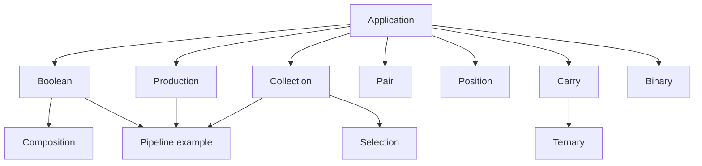

# Native library

[Webbook](../index.html) · [Repository guide](../README.md)

- [Photonic standard library](#library)
- [Atomic fields and explicit order](#structure)
- [Correctness and parallel structure](#proof)
- [Dependency structure and remaining work](#remaining)
- [Atom audit](#atom-audit)

<a id="library"></a>

## Photonic standard library

The library is written entirely in Photonic. The `.particle` files contain the implementation; `.wave` files supply applications. Rust provides source loading, the general evaluator, and execution checks. Every standard-library operation runs through ordinary Photonic rules.

The library supports scalar functions and finite pairs. Arbitrary runtime collections, general repeat counts, generic recursive unpacking, and a general parallel prefix network remain unfinished. The [remaining work](#remaining) records those boundaries. The [proof notes](#proof) distinguish closed finite checks from execution witnesses.

<a id="library-run-the-pipeline"></a>

### Run the pipeline

[pipeline.wave](../example/library/pipeline.wave) runs two independent invocations:

```text
First.Apply.Copy.Pair.([Value] True).Map.([Function] Not).Reduce.([Operation] And),
Second.Apply.Copy.Pair.([Value] False).Map.([Function] Not).Reduce.([Operation] And)
```

Each invocation produces two fresh scalar values in separate coherences, maps Not over both, and reduces the completed results with And. The target is `First.False, Second.True`.

From the repository root:

```sh
bazel run -c opt //example/library:pipeline -- obsidian \
  --target "$PWD/example/library/pipeline.particle" \
  --path --steps 2000000 --states 4096 --cells 256 --frames 64 --coherences 64
```

The checked local execution reaches the target in 40 events and 4210 work steps. This is a serial direct-path witness through a program containing parallel coherences, not a measurement of parallel speedup. Full exploration and worker execution remain available through the existing command options; a suspended search reports Unknown.

`--library` loads declaration-only Photonic files into the same program. It preserves source-file diagnostics and introduces no namespace, import grammar, computation, or initial data. Repeat the option for each dependency. Dependencies are explicit: collection uses application plus the selected function implementation, and production supplies the producer implementation.

See [atomic fields and explicit order](#structure) for the numeral convention and finite Pack/Unpack adapters. [Bazel rules](build.md#rule) load multiple sources and transitive native dependencies.

<a id="library-layers"></a>

### Layers

| Source | Contract |
| --- | --- |
| [application.particle](../library/application.particle) | Apply creates Call inside an invocation scope; Return delivers the result. Identity preserves the remainder. |
| [boolean.particle](../library/boolean.particle) | Not, And, Or, and Equal over explicit True/False inputs. |
| [composition.particle](../library/composition.particle) | Sequential composition of Not and Identity through First/Second descriptors; reuse the same function rules. |
| [production.particle](../library/production.particle) | Produce from a supported Value descriptor; Copy.Pair uses two producer scopes; Repeat.Pair invokes two supplied functions; Broadcast shares the inherited payload. |
| [collection.particle](../library/collection.particle) | Independent left/right mapping, explicit finite gathers, and pair reduction through the selected operation. Empty gather and Boolean empty reductions are explicit. |
| [pair.particle](../library/pair.particle) | Unpack a Boolean pair into independent left/right coherences; Choose uses explicit argument roles. |
| [selection.particle](../library/selection.particle) | Filter, Check, and counting kept members of a completed Boolean pair. Discard is positive completion data. |
| [ternary.particle](../library/ternary.particle) | Local digit addition, sum with carry, subtraction with borrow, selection, multiplication, successor, and directional comparison. Results distinguish Digit and Carry. |
| [carry.particle](../library/carry.particle) | Carry-function composition and evaluation, providing the algebra needed for a future parallel prefix implementation. |
| [position.particle](../library/position.particle) | Pack and Unpack explicitly indexed trits at positions 0 through 3. |
| [stream.particle](../library/stream.particle) | Recursive ternary stream successor with explicit completion. |

Every module has a matching `photonic_library` target. Dependencies supplying function implementations remain explicit where a protocol accepts several functions.

<a id="library-values-and-application"></a>

### Values and application

`Apply.Not.True` evaluates to False. A callable rule value also works:

```text
Apply.True.([Call.True] Return.False)
```

The function value is retained, and the result is False alongside that value. Invocation reads executable code; it does not silently consume an arbitrary function or clone its captures.

Argument fields use ordinary whole rule values. `([Left] True).([Right] False)` preserves roles because the two complete rule shapes differ. This is existing rule-value syntax, not an implicit record or variable convention. Do not introduce the field trigger atoms as executable requests accidentally: these values remain real code.

The implementation uses single-word concepts composed with dots. `Copy.Pair`, `Carry.Compose`, and `([Value] True)` expose their structure. Parentheses in `Function(A,B)` retain their existing shared-prefix meaning and do not become an argument constructor.

Function descriptors currently have explicit implementations, such as:

```text
[Transform.([Function] Not)] Call.Not
```

An additional function can supply its own ordinary rule implementation and dispatch rule. This is an extensible finite protocol, not a generic structural binder or a compiler-enforced trait. Its behavioral obligations include argument shape, result shape, effects, and ownership.

<a id="library-ownership-and-completion"></a>

### Ownership and completion

Produce supports True, False, 0, 1, and 2 descriptors and emits fresh scalar occurrences. Copy.Pair repeats that construction in independent scopes. Repeat.Pair accepts the supported Function descriptors; freshness depends on the supplied function, and Produce supplies the fresh-result behavior. A single producer invocation uses Apply.Produce; Repeat.Empty requests no work and needs no producer argument.

Broadcast preserves inherited resource identity. It is not scalar copying. Gather constructs a new Boolean pair of Left/Right field values; it does not promise to preserve arbitrary resource identity. Copy and Broadcast therefore have separate provenance checks.

Gather and Reduce require both completion markers and the supported payload shapes. Joining only Done or Return markers can lose produced data under source inference. The test suite retains a concrete counterexample to prevent treating silence, a control marker, or a successful trace as a complete-value certificate.

Selection wraps a kept value as `Keep.([Value] True)` and represents a discarded value as Discard. This prevents an ordinary Boolean reduction from mistaking a filter result for a bare Boolean. Pair counting returns 0, 1, or 2.

The APIs assume their documented input shapes. Photonic matching is open: the library does not reject arbitrary extra operands or hostile additional rules. Neither Return alone nor a function's name certifies a complete result. Consumers must require the relevant payload evidence.

<a id="library-verification-and-remaining-work"></a>

### Verification and remaining work

```sh
bazel test -c opt //library:test //system:test
```

The suite checks closed correct/incorrect scalar queries, composition, argument order, supplied rule values, carry tables, incomplete gathers, resource sharing, and resumption with one/two/four workers. It also checks direct-path witnesses for the larger production, mapping, gathering, reduction, filtering, and arithmetic compositions. Library declarations are checked for single-word concepts and at most two input/output coherences per rule.

The current carrier is a pair, not a generic N-element collection. Pair reduction does not establish an associative operation for every supplied function; ternary digit addition returns a digit/carry pair and is not a closed scalar monoid. Kill/Propagate/Generate composition does have the written associative interpretation in the proof notes.

Next: establish a retained recursive collection encoding and complete runtime argument boundaries, then implement tree dispatch, general Repeat, Reduce, and Scan directly in Photonic. General Fold, Loop, Group, dense compaction, arbitrary-width native word arithmetic, and host capability protocols depend on those unfinished contracts. No host implementations stand in for them here.

<a id="structure"></a>

## Atomic fields and explicit order

A particle is an unordered collection of occurrences. In `Digit.0.Carry.1`, nothing associates 0 with Digit or 1 with Carry. Keep each role and its value together in a complete rule value:

```text
([Digit] 0).([Carry] 1)
```

Digit, Carry, 0, and 1 are atomic concepts. Each pair of brackets belongs to a complete rule value, so matching a digit does not mistake a carry value for its payload. These are executable values under the existing language semantics, not a special record syntax or quotation mechanism. Field protocols consume the whole rule value and do not introduce its input trigger.

For a homogeneous ordered collection, a position can be the field's input:

```text
Number.([Base] 3).
    ([0] 2).
    ([1] 0).
    ([2] 2).
    ([3] 1)
```

This numeral represents 47: position 0 contributes 2, position 1 contributes 0 × 3, position 2 contributes 2 × 9, and position 3 contributes 1 × 27. Position means the exponent of the base, starting at zero. Reordering these fields in source leaves the numeral unchanged; exchanging their payloads changes its value.

`Number` and `Base` describe the representation, not built-in number types. Numeric atoms do not acquire arithmetic behavior merely from their spelling. In particular, a missing position is not silently zero and the largest present position does not certify completion. Consumers needing a fixed width must require all positions they depend on. A future dynamic representation will need explicit shape/end evidence.

The [position library](../library/position.particle) implements Pack and Unpack for positions 0 through 3 and payloads 0 through 2. First load `//library:position` through a Bazel dependency; it includes `//library:application`. With the CLI, supply both `--library "$PWD/library/application.particle"` and `--library "$PWD/library/position.particle"`. These names are ordinary concepts with no built-in invocation behavior.

`Pack(Position.0, Value.2)` is not a constructor or a call to this protocol: frontend expansion produces `Pack.Position.0, Pack.Value.2`. To construct a field from tagged data, use the explicit Pack request below. A known field can also be written directly as `([0] 2)`; literal rule values do not require a library.

With the dependencies loaded:

```text
Apply.Unpack.([Position] 0).([0] 2)
```

returns `([Value] 2)`. Its inverse:

```text
Apply.Pack.([Position] 0).([Value] 2)
```

returns `([0] 2)`. These are finite ordinary-rule implementations. They neither parse arbitrary integer positions nor bind an unknown field. They consume the selected field and preserve unrelated remainder; they do not validate a whole numeral or reject arbitrary extra fields. Tests cover every supported position and value, wrong values, missing positions, and field permutations.

For mixed representations, qualify the field role explicitly:

```text
([Digit.0] 2).([Digit.1] 0).
([Negative] 0)
```

A generated arithmetic wire uses the same convention, for example `([Port.12] 2)`. Its role, position, and value are stored separately in the generator's address structure. The output spelling reflects that structure; the generator does not recover it by splitting a compound symbol.

The compact Number representation and qualified circuit output are related conventions, not silently interchangeable types. The former describes one ordered value; the latter can combine several output families such as Quotient and Remainder in one result. An adapter must explicitly establish which fields it maps.

Named abbreviations, when useful, can be ordinary rules:

```text
[Example] Number.([Base] 3).([0] 2).([1] 0).([2] 2).([3] 1)
```

This defines one application-specific name. It is not a generic alias preprocessor, and does not make the atom `47` a parsed decimal numeral. Prefer the structural representation in reusable interfaces, with common behavior supplied by library dependencies.

These fields improve explicitness and symbol reuse. They are not a claim of reduced runtime memory: a whole rule value has structural and capture costs. The finite circuit regression suite checks behavior after the representation change; earlier performance figures for fused atoms do not automatically describe the new representation.

<a id="proof"></a>

## Correctness and parallel structure

The implementation is ordinary Photonic source. The Rust conformance harness constructs queries and inspects the existing runtime; it does not implement the library's operations or generate their rule bodies. Correctness claims below apply to the documented inputs under the supplied library rules.

<a id="proof-evidence-levels"></a>

### Evidence levels

1. A closed query with Reached establishes a concrete witness. A closed query with Unreachable rules out that exact target within the closed graph.
2. A successful direct path establishes one execution. It does not rule out other results, prove universal termination, or guarantee a particular event order.
3. The mathematical arguments below describe intended contracts and local laws. They are not universally quantified Photonic proof certificates.

Scalar functions, argument order, the small composition family, supplied code values, carry composition, and elementary sharing cases have closed finite checks. Larger paired pipelines currently have direct-path checks. Full exploration of scoped producer/map combinations can exceed the retained-record budget even for small inputs. Unknown remains Unknown.

<a id="proof-invocation"></a>

### Invocation

Apply introduces Call inside its body. Initial public requests need not expose Call outside the invocation scope. The body has a local Return rule which releases its result. 2 Not invocations are checked both for the expected pair of results and for incorrect equal-result targets.

Arguments and result payloads still obey open matching and remainder transfer. An arbitrary extra concept is not rejected automatically. A Return marker alone is not a complete-operand certificate. Supplying arbitrary additional executable rules changes the proof assumptions.

A supplied rule value remains available as code after invocation. The tests compare the entire result, including the retained function, rather than silently dropping executable capabilities from the target.

<a id="proof-local-functions-and-fields"></a>

### Local functions and fields

Boolean operations enumerate every unordered Boolean input multiset appropriate to a commutative operator. Not enumerates both inputs. Ternary addition and multiplication enumerate the six unordered pairs of digits; tests exercise all nine ordered input pairs using ordinary integer arithmetic as an independent expected-value oracle.

Directional comparison and selection use complete Left and Right rule values. Swapping the roles changes the input structure; merely permuting particle occurrences does not. Choose is checked against every Boolean condition and both operand values, including incorrect targets.

Composed Not/Identity functions reuse the original Boolean and application rules. The four combinations have closed correct/incorrect checks. This demonstrates the supported continuation pattern; it does not establish arbitrary structural substitution of unknown functions.

<a id="proof-production-and-sharing"></a>

### Production and sharing

Produce consumes a supported Value descriptor and emits the corresponding scalar literally. The runtime's introduction law makes that scalar fresh. Independent producers emit independent occurrences, while Broadcast carries inherited payload occurrences into both outputs with shared identity.

A data-aware reunion of two producer results has a closed two-value witness and rejects a single-value target. Broadcast followed by reunion of its routing markers reaches one inherited value and rejects two. Copy.Pair has a composed witness through its two producer scopes and scalar collection.

Gather constructs a new pair value with explicit Left and Right fields. Its identity contract is value reconstruction, not identity-preserving reunion of arbitrary resources. That distinction prevents a claim about scalar equality from becoming a claim about shared occurrence identity.

<a id="proof-the-completion-counterexample"></a>

### The completion counterexample

The following query reaches a single True even though two independent producers can produce two True values:

```text
Call.Produce.([Value] True),
Call.Produce.([Value] True)
[Return, Return] ()
```

Load production.particle as well. Source inference can justify a Return at a producer's earlier source; consuming only the Return evidence need not carry the produced payload into the output. A join based only on completion labels therefore fails the intended value-preservation contract.

The corrected finite Gather and Reduce rules match both the routing/completion information and the payload values. Their outputs explicitly reconstruct the agreed scalar arguments or pair fields. For example:

```text
[Reduce.Done.Left.True, Reduce.Done.Right.False] Combine.True.False
```

The combination function then uses its own truth table. Filter results use a distinct wrapped representation so the Boolean rule above cannot accidentally treat Keep's payload as an untagged operand.

A missing right operand and two incomplete gathers in separate invocation scopes are checked as unreachable complete-pair targets. The counterexample itself remains a regression test. These checks do not close the general complete-value or unknown-container encoding problem.

<a id="proof-carry-composition"></a>

### Carry composition

Interpret Kill, Propagate, and Generate as functions on a carry bit:

- Kill sends either input to zero.
- Propagate preserves its input.
- Generate sends either input to one.

The composition rule computes the right function after the left function. If the right function propagates, the result is the left function; otherwise it is the right constant function. Function composition is associative and Propagate is an identity. It is not commutative: composing Kill then Generate differs from Generate then Kill.

The nine native composition cases have closed checks against every candidate state. Evaluation on both incoming carry values can be checked independently against the function interpretation. This establishes the finite local algebra needed for prefix computation; no arbitrary-width native prefix network is claimed yet.

<a id="proof-dependency-structure"></a>

### Dependency structure

Copy.Pair dispatches two Build coherences. Each enters a producer scope independently. Each completed production enables its own mapper; one mapper does not wait for the other. Reduce/Gather is a two-input interaction enabled by the required completed payloads. All declared rules have at most two input and two output coherences, including nested rules.

These facts establish bounded local branching and the absence of an explicit left-to-right chain between the two leaves. They do not establish a physical latency bound: scopes, positive evidence derivation, routing, and signal propagation have costs. The direct-path executor selects events serially, so its event count is not the computation's parallel depth.

For a future N-leaf binary tree, bounded fan-out requires at least ceil(log2 N) dispatch stages from one request; a result depending on N independent leaves similarly requires logarithmic fan-in depth. A balanced construction can attain those asymptotic bounds if the recursive representation exposes both children independently. The current pair carrier does not yet provide that arbitrary runtime representation.


<a id="remaining"></a>

## Dependency structure and remaining work



These are build dependencies, not scheduling edges. Collection dispatches supplied operations; the application selects their implementations explicitly. Stream successor has a separate recursive protocol and no application dependency.

The host circuit generator remains in `mathematics/arithmetic/`; its emitted fixtures are in `mathematics/arithmetic/fixture/ternary/`. It is not a native standard-library implementation. Binary and ternary circuits use the same `Digit` role and literal field values. The native binary module uses `Binary.Sum` and `Binary.Multiply` to identify its radix-specific operations.

General runtime collections need retained structure, argument boundaries, and positive shape/completion evidence. Those contracts precede general Repeat, Map, Gather, Reduce, Scan, and arbitrary-width native arithmetic. Associative carry composition is established, but a generic native prefix network remains unfinished. Fold and Loop retain their causal dependencies; external capability protocols require effect-commitment rules before execution can explore alternatives safely.

## Atom audit

The native modules contain single-word concepts or numeric literals. Position and value remain separate fields; field order in text is irrelevant. The binary-only `Bit` spelling and Zero/One/Two encoder are removed, and both circuit radices use the same structural address formatter. Library algorithms remain ordinary Photonic declarations.

Retained atoms have separate protocol obligations:

| Role | Why it remains |
| --- | --- |
| Apply, Call, Return | Invocation boundaries and scoped result delivery. |
| Left, Right, First, Second, Position | Argument association or explicit sequence position. |
| Ready, Done, End, Empty | Stage or shape evidence; absence is not completion. |
| Value, Digit, Carry, Borrow, Base | Payload association and representation. |
| Keep, Discard, Success, Failure | Explicit selection and validation outcomes. |
| Copy, Broadcast | Fresh production versus inherited resource sharing. |
| Sum, Add | Three-input versus two-input trit operations; open matching cannot safely infer exact arity from missing operands. |

Removing a marker requires demonstrating that its information is already carried by structure. Matching only completion markers can lose payloads; the suite checks a counterexample. Retained-input multiplication also needs its archives to distinguish produced values from forwarded operands. Atom count alone is not an optimization criterion.
