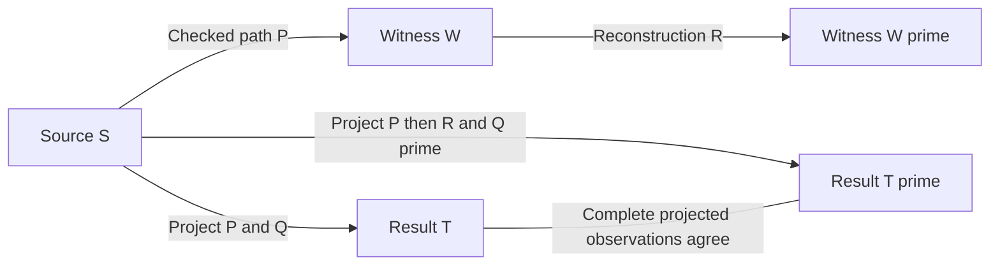

# Reconstruction and projected execution

This audit extends baseline `9a87a92`. It states one conditional construction/projection law and exercises it in the independent reference model. It does not establish the full template flow law, arbitrary structural matching through source inference, external grounded support, or native structural execution.

## The two paths

Let `P` be a checked finite path from source configuration `S` to witness configuration `W`. Let `Q` be a valid projected application request selecting a local executable occurrence `c` in a participating world `w`. The ordinary route projects `Q` through `P` and applies the resulting binding to `S`.

The reconstruction route qualifies the actual occurrence `c` at the endpoint of `P`, opens its complete rule, binds and reconstructs its input and output, and publishes the completed rule back into `w`. Publication consumes exactly `c` and introduces a fresh executable occurrence `c'` in a fresh world `w'`. Call this checked construction step `R`. Request `Q'` selects `c'` and replaces `w` by `w'` in its selection. Other participating worlds and selected argument occurrences retain their identity. Project `Q'` through the extended path `P;R` and apply it to the same source `S`.



The input to reconstruction is a complete qualified fragment, not source text or an abstract descriptor. [Reconstruction.apply](../model/reconstruction.rs) checks its value and complete evidence against qualification of the selected executable. Equal syntax with a different proof prefix, witness, capture, history or additional read obligation is outside this exact-reconstruction relation. A declaration reference is outside the operation's domain: declaring code and reading a local occurrence have different support.

The operation also checks that publication preserves the executable's complete nominal rule value. If materialization would choose different nominal capture representatives, it reports an identity failure instead of assuming that existing argument matching is invariant. Construction must have sufficient allocation capacity. Failure leaves the supplied Transition and its checked path unchanged.

## Observations and support

For an admitted reconstruction, the law requires equality of the projected Binding: execution frame, optional source owner, participating source worlds, consuming footprint, exact subset and executable reads. It also requires equality of the complete projected Event: result Configuration, resource/world/frame flow, reads, consumed places, imported owner and every addressed import-origin map. Equality includes held resources, graph sharing, lexical and parent edges, contextual declarations, local binder structure, occurrence histories and deterministic source-side allocation state.

The witness path changes. Its full flow is related by the explicit construction step:

```text
flow(P;R) = flow(P) compose flow(R)
flow(R)(World(w', c')) = {World(w, c)}
read(R) = consumed(R) = {World(w, c)}
```

All other surviving occurrences and frames follow the ordinary publication flow. The fresh executable has a dependency on the consumed original occurrence; it does not inherit that occurrence's nominal identity. If `c` was shared with another world or held place, that other reference still names `c`. The witness configurations therefore need not be graph-isomorphic. This law compares the complete projected results and the explicit witness-flow composition, not arbitrary equality of the witness endpoints.

Support is an extension, not an erased or interchangeable proof. `P` remains an exact prefix of `P;R`, including every intermediate configuration, read record, nested auxiliary path, historical witness, qualified proof anchor and archive origin. The added construction record retains the endpoint qualification of `c`. Its single immediate read is justified by the actual live executable in `W`. `Transition.retain()` preserves either supporting path inside its inferred step. The resulting retained paths have equal result configurations and composed result flows, but remain different proof values; aligned derivation comparison rejects the different support lengths.

## Preservation argument

The argument uses the current checked-path and exact ground-application contracts. It is a written reference argument, not a mechanized theorem.

1. Qualification reads the selected complete occurrence at `W` and retains its value, history, current proof prefix and canonical capture origins. Opening and closing its rule preserve the owner and all evidence. Typed template references preserve the bound input and output sorts; local binder depths remain inside their complete bodies.
2. Every capture in this qualification already has a representative in `W`: it comes from the selected world's context or the executable's actual contextual value. Materialization can reuse those representatives. The explicit nominal-value check excludes any case where that reuse changes a rule reference. Publication changes the selected world and executable occurrence, preserves the unconsumed arguments and their contents, and leaves reachable captured frames and held resources unchanged. Reclamation may remove unrelated frames, but cannot remove a frame reachable from the retained executable or participating worlds.
3. Matching `Q'` uses the same complete rule and argument values as `Q`. The participating world's context is unchanged. Its source-world ancestry follows the singleton world edge in `R`. Every selected argument retains its former resource basis and capture origins. Consequently the projected execution frame, owner, source worlds, footprint and exact subset agree. This covers ordinary and scoped outputs: their differing use of footprint and exact consumption is preserved, not equated.
4. The executable read through `P;R` is the projection of `{World(w', c')}`. By the displayed singleton edge and flow composition, it equals the projection of `{World(w, c)}` through `P`. Earlier reads remain in the unchanged prefix. This reasoning does not identify a consuming basis with all retained support.
5. Source application begins from the same `S`, uses the same projected binding and the same complete rule/capture graph. Existing source representatives, missing captured frames, held-resource origins and canonical capture addresses are unchanged by appending `R`. Deterministic import and rewrite therefore produce the same complete Event, including transient import metadata and source-side allocation. Auxiliary allocation of `w'` and `c'` does not advance allocation in `S`.

The nominal-value admission check and fresh-allocation requirement are explicit premises. This argument does not assert that every possible capture normalization or exhausted endpoint can reconstruct successfully. The test suite does not manufacture arbitrary records; both routes use checked Paths and projected applications.

## Counterexamples that constrain the law

Read-only publication of the same reconstructed value is a different operation. With empty consumption, the fresh executable's resource basis is empty. Projected application can then have the same result configuration, consuming flow and consumption as the original application while its immediate executable-read set differs. The construction record still contains its inspected-code read, so the larger proof cannot be replaced by the smaller immediate read set. The law requires consumption of the selected executable precisely to preserve its projected executable-read boundary; this is not an optimization that turns all inspection into consumption.

Reconstructing one occurrence of code shared across two worlds produces a fresh code identity in only that world. The witness graphs differ in sharing and resource count, even though their projected source results agree. Requiring graph isomorphism at this intermediate boundary would reject a justified reconstruction; silently merging the fresh and original identities would be incorrect.

A generated executable need not have an executable source predecessor. For a checked derivation that consumes `Seed` to produce a rule, the rule's projected read basis contains `Seed`, which is an atom. Structural binding must inspect the actual generated rule at the witness. Attempting to inspect the basis atom as a rule fails. Projection preserves dependencies; it does not infer a predecessor's structure from the generated value.

The reconstruction API rejects changed structure even when its evidence agrees, equal structure with missing or extra witnesses, a detached proof anchor, a different branch history, declaration references, and exhausted reconstruction allocation. These are structured failures, not an assertion that such constructions are universally invalid. Some are valid separate construction programs whose observations and support require a different law.

## Reference evidence and remaining work

Ten [reconstruction test families](../model/test/reconstruction.rs) exercise the two routes. A sixteen-case matrix varies unchanged versus transformed operands, absent/empty/scoped/mixed destinations and nominal allocation offsets, then reconstructs twice. Further fixtures cover captured lexical code with absent or live-shared reserves through three historical restoration cycles, sibling auxiliary captures through repeated qualified restoration and actual lexical execution, nested inference, a local executable shared across worlds, generated executable reads, the read-only counterexample, invalid fragments, allocation exhaustion and one to three transient imported frames sharing a freshly copied held resource. Input/output reconstruction uses typed template bindings; a suspended template reference agrees at every interruption boundary. Successful paths replay and their recorded main-path configurations revalidate.

The model passes 165 tests; the separate conformance target retains 14 families and 43 native comparisons. This increment adds no native comparison or production syntax. Reference construction, qualification, sealing, graph materialization and projection remain atomic operations for accounting purposes.

The next part of roadmap 3.4 is changed-shape template construction from projected witnesses. It must specify how each bound component denotes code description, a captured reference or a transferred live occurrence, then relate construction before and after transport of those bindings. It must retain complete contextual results, exact and broader consumption, executable reads, ownership and full auxiliary/historical support. The exact-reconstruction law above cannot be used to equate arbitrary changes of structure or erase additional dependencies. Grounded external evidence, resumable quotation and native integration remain separate gates.
