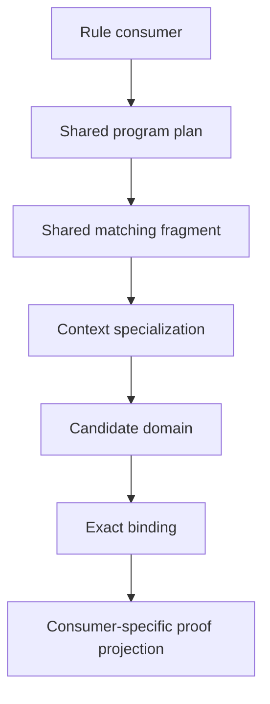

# Architecture and capability roadmap

This is an implementation plan, not a report of completed optimization. The current priorities extend the incremental evaluation work with structural construction, recursive collections and independently checked evidence. Runtime optimization preserves the existing language and frontend contracts; structural construction remains an explicit semantic extension. Each implementation audit names its tested baseline, records measurements, and states the remaining boundary; the stages below are not a claim that every research track has shipped.

## Current priority

Planning baseline: `b820bc3`, reviewed on 2026-09-21. The [CPU continuation](continuation.md) already delivers chunked persistent transcripts, completed exhaustive query replay, parameterized flow templates and large-search CPU admission. Do not schedule those capabilities again under their older roadmap descriptions.

Implementation queue: the [complete recursive value contract](collection.md) specifies order 1's carrier, boundaries, ownership and forbidden outcomes. The [independent model](model.md) now implements typed closed fragments, contextual reconstruction and restricted branch-history compatibility. Next are scoped typed bindings, contextual templates and resumable construction, followed by concrete application and source-inference projection. Order 2 remains incomplete until those semantic gates pass; host-driven model generation is not a native generator. Commit each verified increment on `main` and update this queue; the full roadmap objective remains active while any required milestone is unimplemented or unverified.

The next capability milestone is one runtime-sized recursive collection processed by supplied code, with complete payload preservation. Use that program to drive structural semantics and expose actual runtime bottlenecks. Prioritize complete value boundaries and structural construction; limit ambitious runtime research to one bounded experiment at a time. Further optimization is conditional on a demonstrated workload, not a prerequisite for every capability change.

| Order | Deliverable | Acceptance gate |
| --- | --- | --- |
| 1 | Specify a recursive collection, complete argument/result boundaries and its supplied-operation interface | Explain empty and incomplete values, payload association, shared versus fresh occurrences, and source-inferred completion; retain explicit forbidden outcomes |
| 2 | Build the small structural construction reference model from [dynamic.md](dynamic.md) | Unknown-field construction, unknown-rule reconstruction and mixed-capture composition preserve resource and history dependencies; no dangling external binding becomes executable |
| 3 | Implement the minimum construction and collection support needed for the demonstration | One fixed program processes increasing runtime collection sizes; gather and reduction preserve complete payloads; native and WebAssembly observations agree with the reference |
| 4 | Export and independently check restricted finite reachability certificates | The checker validates consuming footprints, executable reads, captures, auxiliary derivations and grounded support without invoking optimized search; corrupted evidence is rejected |
| 5 | Select one runtime experiment from measured costs of the demonstration | Repeatable complete-program benefit, bounded storage and cold construction cost, with existing progress and evidence contracts preserved |

Collection semantics should be specified independently of a particular construction implementation. Determine whether the first carrier can use the existing ground core; require structural construction only where the example actually needs it. Keep algorithms in Photonic and avoid runtime special cases for collections or arithmetic. A Return or Done marker alone is not a complete-value certificate: the [library counterexample](../index.html#guide-library-proof-the-completion-counterexample) must remain covered.

The full structural milestone additionally requires one fixed generator whose runtime input controls code depth beyond every shape in its source, followed by a generator that constructs another generator. Precompiled rule occurrence production does not satisfy either requirement. Complete the template flow law, mixed-capture contract and interaction with inferred witnesses before selecting public binder syntax.

Independent reachability checking is separate from certifying unreachability, universal mathematical proof objects or durable runtime checkpoints. Start with a precisely bounded evidence format and an independently implemented checker. A short event path is insufficient when source inference depends on auxiliary derivations. Keep the trusted rule set and unsupported certificate cases explicit.

### Value and effort

These are planning judgments, not performance measurements or delivery promises. Ranges assume one experienced engineer familiar with the repository and include testing and integration for a restricted useful implementation. Research uncertainty may extend them substantially. Dependencies overlap, so the estimates must not be summed as an unconditional project schedule.

| Opportunity | Expected value | Initial effort | Decision |
| --- | --- | --- | --- |
| Complete recursive values and collections | Very high capability value; enables reusable native algorithms | 4–8 engineer-weeks, longer if new construction semantics are required | Prioritize the concrete demonstration |
| Structural rule construction | Very high capability value for reflective programming | 2–3 week semantic prototype; 8–16+ weeks for a restricted integrated implementation | Prioritize semantic laws before syntax |
| Independent reachability certificates | High verification value; portable evidence with a smaller checking boundary | 4–8 weeks for a restricted format and checker | Next verification milestone |
| Shared maintained interior joins | High for repeated changing queries; uncertain for current arithmetic | 4–8 weeks for one operator family | Admit from a representative workload |
| Lazy trace composition and continuation checkpoints | Moderate; avoids measured copying and cursor reconstruction | 2–4 weeks | Require material profile attribution |
| Stronger canonicalization | Potentially very high for symmetric states, limited elsewhere | 3–6 weeks for a restricted implementation | Compare a prototype with the existing oracle |
| Causal-history compression | Very high possible storage benefit with very high semantic uncertainty | 3–6 months for a restricted integrated version | Keep as a research track |
| Dispatch/index redesign | Moderate to high possible latency benefit | 1–2 week experiment before estimating integration | Stop unsuccessful experiments |
| GPU execution | Low immediate expected value on current evidence | Several months for a useful integrated path; low confidence | Defer until a bulk workload establishes crossover |

The latest continuation audit attributes approximately 39 ms to dispatch, 13 ms to indexing and 2 ms to matching within a 70 ms instrumented expression run. Subscription time is nested within dispatch. Illustratively, eliminating matching saves only about 3%; halving dispatch yields about 1.39× overall speedup, and halving dispatch plus indexing yields about 1.59×, assuming all other costs remain unchanged. These are Amdahl calculations from one diagnostic workload, not forecasts or fresh measurements. The paired ordinary-arithmetic results remain approximately unchanged, and rejected allocation experiments remain rejected.

Do not assign a numerical expected speedup to shared joins, symmetry handling or causal compression before identifying repeated work in a representative program. These techniques can remove combinatorial repetition on suitable workloads, but cannot remove the cost of required output or evidence.

### Bounded research

Potential novelty concerns the combination of resource identity, captured code, competing histories, proof evidence and exact resumable progress. Reflection, contextual code, incremental joins, provenance and partial-order methods already have substantial prior art. A research claim requires a precise comparison and preservation argument; implementing a combination is not itself evidence of originality.

| Experiment | Concrete scope | Success criterion | Stop or defer condition |
| --- | --- | --- | --- |
| Certified execution blocks | Derive a certificate for a restricted negative matching suffix, starting with one binding per candidate and fixed input order | Exact logical waiting length, dependency validity and reconstructible continuation at every interruption; certificate construction and use beat scalar traversal | Counting costs as much as traversal, certificates grow with the expanded work, or progress cannot be reconstructed cheaply |
| Construction with capture and history evidence | Compose two differently captured code fragments and reconstruct their executable structure | Permitted execution succeeds; cross-history evidence and accidental capture merging remain impossible under the reference laws | The mixed-capture or template flow law is unresolved; continue semantic work before production implementation |
| Compact causal evidence | Represent a small family of independent firings and derive existing inspection and checking views | Reconstruct every required state, event, flow, support and suspended observation while reducing total retained storage | Inspection or checking incurs unacceptable reconstruction cost, or independence drops observable evidence |
| Shared maintained join | Two distinct plans share one interior relation under coherent updates | Insertions, removals, occurrence reuse, capture changes, private delivery and eviction match independent enumeration; total maintenance pays for itself | Discovery, cold construction or invalidation dominates actual reuse |
| Stronger canonicalization | Compare a restricted individualization/refinement implementation on rings, repeated modules, captured symmetry and near-symmetric controls | Exact equivalence and identity mappings agree with the oracle; bounded-progress behavior and complete execution improve | Graph encoding loses resource/capture structure or small-state overhead exceeds the protected tolerance |

Certified blocks generalize the direction in [certificate.md](certificate.md); they are not implemented by the existing retrospective transcript cache. A block needs exact dependencies, output/evidence behavior, logical work and a continuation strategy for interruption inside its span. Begin with the restricted suffix counter, then consider composition or bulk execution only if the first experiment succeeds. No general exact counting result is assumed.

Before changing execution granularity, inventory externally observable progress and distinguish logical work from implementation cost. Existing pending steps, queue order and budget behavior remain the compatibility target. Any alternative execution mode with different observations requires a separately specified contract; this roadmap does not authorize silently weakening the current one.

Prior work for the new tracks includes [Moebius](https://arxiv.org/abs/2111.08099) for contextual code analysis and generation, [Contextual Metaprogramming for Session Types](https://arxiv.org/abs/2601.15180) for contextual code with linear resources, [provenance semirings](https://www.cs.ucdavis.edu/~green/papers/pods07.pdf) for annotated derivations, [unfolding-based partial-order reduction](https://arxiv.org/abs/1507.00980) for causal exploration, [nauty and Traces](https://users.cecs.anu.edu.au/~bdm/nauty/) for canonical labeling, and [independent LFSC checking](https://cvc5.github.io/docs/cvc5-1.3.4/proofs/output_lfsc.html) for separating discovery from evidence validation. These are precedents, not proofs of Photonic equivalence.

### Deferred work

General Fold, Loop, Group, dense compaction and a native parallel prefix network follow the complete collection contract. Host capabilities require explicit effect commitment under alternative exploration. Broader target encodings must preserve captured-frame graphs and shared introductions. Universal proof objects, unreachability certificates, hard resource isolation and live program edits remain separate milestones. Strong identity types and ownership improvements should accompany the boundaries being changed rather than trigger an unrelated kernel rewrite.

For the current finite ground evaluator, consolidation and application development are valid stopping points. GPU execution, a universal optimizer, causal reduction and every historical runtime stage are not completion requirements. Record failed experiments and retain exact fallback paths; promote an experiment only after semantic and end-to-end performance acceptance.

## Runtime implementation history

The first production implementation and its remaining boundaries are tracked in [implementation.md](implementation.md). The subsequent [factorization audit](factorization.md) records retained leaf bindings, adaptive intersections, and cyclic reachability. The subsequent [architecture audit](architecture.md) adds localized domain updates, incremental grounded support, and explicit proof-store ownership. Read these historical boundaries together with the latest continuation audit and the current sharing table below.

The target is an evaluator that shares reusable program structure, discovers concrete work on demand, and maintains derived results from explicit changes. Decisions are conditional on semantic equivalence and measured benefit. No universal speedup or globally optimal query plan is assumed.

The [joined-prefix implementation](prefix.md) now retains bounded multi-input prefixes across suffix-only changes and gates admission on observed reuse. It preserves exact pending/binding streams and falls back to direct traversal under prefix churn. The [sharing implementation](sharing.md) adds completed prefix transcripts across distinct direct-dispatch plans, bounded canonical environment reuse and immutable identity flow sharing. Interior fragment retraction is described in the later interior audit; arbitrary row-level maintenance, exhaustive subquery sharing and general contextual construction remain unfinished.

The [candidate-domain implementation](candidate.md) shares presence filters and dependency summaries across distinct plans, maintains complete candidate snapshots across verified deltas, and supports late activation with exact fallback. Query-local occurrence arrays and mutable particle cursors remain private. Later stages add retained joined fragments and completed exhaustive replay; cross-plan maintained interior relations remain open.

The [dispatch dependency audit](dispatch.md) now removes repeated lexical-ancestor walks within each update and transient activation during coherent symbol changes. Detailed profiling showed agenda restart was a small part of arithmetic dispatch cost, so the existing progress-preserving restart remains. The subsequent [partition audit](partition.md) implements the first bounded joined-fragment maintenance slice. A persistent agenda remains unimplemented; the later [reconciliation audit](reconciliation.md) adds an incremental reverse lexical dependency index. The subsequent [interior matching audit](interior.md) extends retraction below the first input, adds immutable unfinished prefix snapshots and removes the inherited prefix regression through a cheaper symmetry check. The [CPU research review](research.md) gives the next priorities and updated primary sources.

## Semantic boundary

- State is unordered. Synchronization establishes a firing; planner order and scheduler order are implementation details.
- Bindings retain resource occurrence identity, multiplicity, distinct-world constraints, captures, lexical ownership, and executable-rule read dependencies.
- Sharing a description never merges live occurrences or makes evidence from competing histories jointly available.
- Every successful optimized operation reconstructs the exact binding, state change, and provenance required by the existing evaluator.
- A summary can reject a match only when it conservatively covers every concrete candidate in the relevant context. Passing the summary establishes a possibility, not a proof.
- Failure to match a current snapshot is not proof of permanent unreachability. Incomplete or suspended enumeration is never cached as absence.
- Inspectable history, support, reporting, resource limits, and suspension behavior remain part of the compatibility contract. A different cache footprint or traversal must not silently alter that contract.
- Arithmetic receives no special treatment. Frontend syntax, browser defaults, and planned language capabilities are not restricted for optimization.

Before changing scheduling or accounting, specify which progress details are externally observable and retain their current behavior. If an optimization cannot preserve a required observation, leave that optimization out of the production path. A mathematical proof of result equivalence alone does not establish compatibility with a bounded, inspectable runtime.

## Current sharing and remaining gap

| Layer | Existing implementation | Remaining work |
| --- | --- | --- |
| Code | `program.rs` interns complete rule values | Discover reusable internal structure without identifying executable occurrences |
| Input | `catalog.rs` shares complete inputs and immutable particles; `joining/store.rs` shares exact complete and unfinished prefix snapshots between direct plans | Discover additional reusable internal subplans |
| Context | Capture-sensitive prefix keys, capture-free input identity and bounded weak reuse of canonical environments | Broader contextual specialization with explicit boundary dependencies |
| Candidate | Shared exact filters, dependency summaries, eligible insertions, and incremental candidate snapshots in `candidate/`; indexed eligibility and bounded shared immutable preparation | Share consumer occurrence storage; immutable exhaustive preparation is now shared |
| Binding | Bounded replay, surviving leaf factors, projected multilevel fragments, shared unfinished snapshots, persistent binding payloads and chunked record transcripts | Cross-plan partitions, lazy parent-trace composition and efficient continuation checkpoints |
| Proof query | `runtime/table.rs` shares exact queries; `selection/` shares captured preparation; `gate/` reuses abstract assignment decisions; `search/` replays completed exact query transcripts | Maintain interior multi-particle query fragments while preserving consumer-specific gates and projection; scheduler-aware waiting-span batching |
| Rewrite | `recipe.rs` compiles output construction | Reuse parameterized construction with explicit boundary dependencies |
| History | Persistent state, exact provenance, incremental capture reachability, grounded support, nonidentity union reuse and parameterized flow templates | Broader contextual rewrite construction, independently checked evidence and causal representation |

The direct path and exhaustive backward runtime have different responsibilities. Shared primitives can serve both, but migrating the exhaustive runtime cannot remove source inference or proof projection. Its separate algorithms are useful reference behavior, although some underlying storage and indexing are already shared.

## Sharing from abstraction to instance

Use a graph of reusable computations with explicit interfaces. A source-level abstraction is a discovery hint, not a sufficient cache key: lexical nesting and similar names do not establish semantic equivalence. Within a compiled matching plan, shared fragments form a directed acyclic graph. Recursive proof dependencies require separate strongly connected components and fixed-point processing.

Demand travels from rule consumers toward the data needed by their plans. Changes travel from concrete data toward the affected derived computations. Neither direction imposes an execution order on Photonic firings.

The first implementation discovers exact reuse. Intern identical operators with their child identity and parameter interface. Index symbol and multiplicity signatures to find candidate common fragments, then verify equality exactly. Search a bounded set of fragments already exposed by rule structure or observed reuse; do not enumerate every subset of every input. Any normalization of unordered structure must retain the permutation needed to restore existing input-position and reporting behavior.

As an illustration, two plans that each require separate worlds containing `A` and `B`, followed by different requirements `C` and `D`, may share the `A`/`B` fragment in the same compatible context. Extension must still check that the third world is distinct, that resource multiplicity is valid, and that each consumer's evidence is compatible. Sharing the fragment does not share the entire proof.

Later, parameterized templates can represent several structurally equal plans with different explicit parameters. Structural anti-unification is a candidate discovery technique only: the original constants and capture requirements must be reinstated at specialization. It must not introduce new pattern variables or change language matching.

Use these cache boundaries:

| Layer | Reusable value | Validity boundary |
| --- | --- | --- |
| Program | Immutable exact plan and recipe | Program identity and verified structural identity |
| Summary | Conservative symbol, count, shape, and scope information | Snapshot or explicitly maintained dependency version |
| Context | Plan specialized to its environment | Required ownership, capture, visibility, and boundary mapping |
| Domain | Candidate occurrence and prepared particle match | Context plus site/resource generation and exact dependency |
| Binding | Factorized partial result and enumeration frontier | All contributing domains, residual constraints, and consumer position mapping |
| Proof | Shared derivation or parameterized construction | Exact source evidence, read support, capture mapping, and fresh identity substitution |

Global immutable plans must never embed a live frame or resource identity. Initially use explicit conservative context keys. Reduce the key only after proving that omitted context cannot affect the value; arbitrary whole-state equivalence or unrestricted query containment is not a practical lookup operation.

Sound summaries can avoid expensive refinement. For example, insufficient possible resource occurrences can rule out a current binding before token enumeration. Counts must conservatively account for sharing, alternative histories, capture eligibility, and world boundaries. Unknown or stale summaries fall through to exact evaluation. Negative results require a complete relevant search or a sound exclusion certificate and are invalidated on relevant changes.

Demand must include every consumer required by the existing execution mode. In exhaustive mode, it cannot mean only the user's final expression or a favored proof branch. A suspended shared computation must retain enough state for every subscriber to receive its own complete result stream without duplication or starvation.

## Incremental partial matching

Replace whole-stream invalidation incrementally, with the current exact traversal available during development:

1. Represent a reusable partial binding with explicit consumed occurrence, read dependency, capture dependency, and remaining constraint.
2. Maintain reverse dependencies from changed sites and context components to affected fragments. Version reusable slots so a new occurrence cannot revive an old binding.
3. Apply each rewrite's removals and insertions as one coherent delta relative to a snapshot. Do not expose partially updated indexes or mixed versions to a consumer.
4. Preserve unaffected fragments. Extend inserted candidates against compatible retained fragments; retract only unsupported results. Handle simultaneous changes to several inputs without duplicate derivations.
5. Keep result multiplicity and evidence distinct. A support count can maintain existence, but it cannot replace the identity of competing derivations or consumed resources.
6. Enumerate products lazily with independent consumer cursors. Retain continuation state when a prefix is only partially explored.
7. Bound retained state globally as well as locally. Eviction discards recomputable acceleration data, preserving required continuation and proof data. It never truncates answers.

Cache admission uses measured reuse, construction cost, update rate, fanout, retained bytes, and logical records. Small or frequently changing queries can use direct traversal. Introduce deterministic policy and hysteresis before attempting sophisticated online tuning. Compare discovery and maintenance overhead against saved work, including consumers that stop early.

The desired cost follows the changed dependency region plus newly demanded results. This is a workload-sensitive objective, not a bound that defeats combinatorial output size. If an update invalidates nearly every result, broad recomputation may be optimal.

## Ownership and API design

Move related state and its invariants into an owning component rather than adding more files containing methods on the same large `Runtime`.

| Responsibility | Owns | Boundary |
| --- | --- | --- |
| Model | Program meaning and exact state | No scheduler, cache, or reporting dependency |
| Storage | Persistent representation and allocation | Stable identity distinct from physical position |
| Index | Derived lookup and graph metadata | Applies validated state changes |
| Matching | Plan, domain, subscription, cursor, and reuse | Emits exact bindings; does not construct proof state |
| Rewrite | Binding application and construction | Emits state, change, and required provenance |
| Proof | Flow, evidence, support, and history | Preserves competing derivations |
| Runtime | Agenda, suspension, limits, coordination | Composes components through explicit operations |
| Report | Inspection and external representation | Reads a consistent snapshot |

Matching subscription/cache/cursor ownership, proof normalization, and grounded evidence now have dedicated stores. Continue tightening identity and flow ownership at those boundaries. Keep accounting with the structure it measures, using one consistent aggregate interface; avoid independently maintained duplicate totals.

Use distinct identity newtypes where interchange is invalid, with unabbreviated namespace-based naming such as `frame::Identity` and `resource::Identity`. A live stable site, a historical occurrence, and a current ordinal are different concepts. Use generation checks where reuse is possible; never expose arena placement as semantic identity.

Replace positional argument groups with a named request when they describe one operation, particularly rewrite source/context/binding. Validate a binding against its snapshot at the boundary before applying it. Use concrete structs and enums, private fields, early returns, immutable plans, and exclusively owned mutable cursors. Introduce a trait only for a real substitution point. `Option`, `Result`, and `Poll` represent absence, failure, and cooperative progress respectively.

Keep identifiers singular, one word, and unabbreviated. Put explanations and invariants in design documents. Remove dead paths after equivalence and performance acceptance; retain a deliberately small test oracle rather than a permanent duplicate production framework.

Use explicit Bazel source lists and narrow visibility. Introduce crate boundaries only at stable ownership boundaries where dependency enforcement and incremental rebuild behavior justify them. Avoid a crate per file. Preserve hermetic native and WebAssembly builds with Bazel as the only system build prerequisite.

## Incremental evaluation stages

This table retains the original runtime decomposition and its acceptance gates. It is not a fresh sequential backlog: substantial portions have shipped, as described below. The current priority section governs the next work; remaining runtime stages are selected by workload evidence.

| Stage | Work | Acceptance gate |
| --- | --- | --- |
| 0 | Record observables, benchmark manifest, and phase counters | Reproduce current arithmetic regression and matching gains on an isolated revision |
| 1 | Extract matching and normalization ownership; tighten identity and request APIs | Exact existing snapshots and suspension behavior; no meaningful end-to-end regression |
| 2 | Compile a shared exact fragment graph; retain consumer projections | Work saved across different rules, with bounded discovery cost and identical binding/proof multiplicity |
| 3 | Add conservative summaries and demand-driven context specialization | No false rejection; complete exhaustive demand; cold and low-reuse workloads remain competitive |
| 4 | Maintain bounded factorized partial matches under deltas | Insert/delete/reuse/pause sequences agree with fresh exhaustive enumeration; bounded retained memory |
| 5 | Add adaptive intersection, residual assignment filtering, and safe decomposition | Benefit on skewed/wide constraints without regressions on simple matching |
| 6 | Localize posting removal, reachability, fingerprint, and rewrite construction work | Exact full recomputation agrees through cyclic frame and capture mutation |
| 7 | Share flow composition and proof support; add contextual rewrite templates | Full backward-inference and competing-evidence equivalence, including recursive support |
| 8 | Develop compact causal history and an independence relation | Reconstruct all required observations; reduction only with a suitable equivalence argument |
| 9 | Evaluate generic instruction fusion and parallel execution | Preserve synchronization, logical accounting, and inspection; measured native and browser benefit |

Current acceptance state: stage 2 includes shared complete and unfinished prefix snapshots and exact candidate-filter nodes; stage 3 includes conservative dependency summaries; stage 4 includes candidate membership maintenance and projected joined fragments at adaptively retained interior depths. Reverse dependencies cover relevant ancestor occurrences and the anchor, while each layer explicitly invalidates changed searched-domain intervals. Exact progress, slot reuse, bounded storage, saturation, producer/follower interleavings and eviction restoration are covered by differential tests. The later interior audit resolves the inherited protected prefix regression using transitive symmetry checking.

The [preparation audit](preparation.md) implements bounded sharing of immutable particle preparation with private cursors and occurrence-native candidate lookup. The [multilevel audit](hierarchy.md) adds projected ancestor context and a bounded per-join forest. Short reusable fragments can retain several depths; longer fragments retain a cheaper single-depth representation. The [CPU checkpoint](cpu.md) adds persistent child links for binding payloads, and the [continuation](continuation.md) adds chunked persistent record transcripts. Parent extension still constructs record headers and prefix links; lazy composition and cross-plan partition sharing remain open. Unfinished snapshots do not share a mutable producer, and exhaustive proof projection remains separate.

The [capacity rejection audit](residual.md) rejects insufficient token multiplicity before allocation without skipping candidate visits. General residual assignment filtering remains open. The [exhaustive preparation audit](exhaustive.md) adds bounded captured-pattern interning and immutable preparation sharing, retaining private gates and proof projection. The [batching audit](batch.md) implements exact consumption of cached direct-path waiting spans, preserving scalar observation and budget boundaries. The [parallelism audit](parallel.md) measures small exhaustive fixtures, which favor one worker; the CPU checkpoint and continuation add conservative admission for large normalization and search work. Completed exhaustive query replay and parameterized flow templates are delivered. Broader maintained interior queries, contextual rewrite construction and further subscription/index changes require their own measured gates. GPU remains deferred.

Stages 2 through 4 are the first major algorithmic milestone. Stages 5 and 6 can change priority according to measured bottlenecks. Stages 8 and 9 are conditional research tracks, not promises that an implementation must contain these techniques to be complete.

The initial runtime sequence established the semantic/performance harness, ownership boundaries, shared planning, conservative context reuse and maintained fragments. Expand supported operators only after each new vertical slice passes its gates. Keep changes separately measurable so refactoring and algorithmic gains can be distinguished.

The [dynamic construction proposal](dynamic.md) remains a separate semantic extension prioritized above. Runtime optimizations must not bake a permanently closed program catalog into every layer. Keep compiled plan storage separate from executable occurrence activation, make identity and invalidation explicit, and specify the extension boundary for future plan registration. Optimization-only changes must not introduce speculative dynamic syntax or unused compatibility machinery; structural implementation follows the reference-model gates.

## Verification and measurement

Use differential, generated, and metamorphic tests at stable boundaries. Compare full binding multisets and provenance, not only final arithmetic answers. The direct and exhaustive engines are compared only on their common semantic domain; backward inference also needs its own reference cases.

Required adversarial coverage includes unordered permutations, administrative renaming, duplicate values with distinct identity, reused slots, captured equal code, competing histories, executable read dependencies, empty inputs, wide gates, interrupted enumeration, cyclic reachability, cyclic unsupported evidence, fingerprint collisions, simultaneous insertion/deletion, cache eviction, new subscribers, and exhaustion immediately around a delivery. Abstract filters must be checked against exact candidate enumeration.

### Metaprogramming and recursion

Deep metaprogramming is a release gate for optimization, not an optional benchmark. The requirement is zero known semantic regressions. Testing cannot establish the absence of all kernel bugs; combine independent expected results, bounded exhaustive comparison, invariant checks, and an explicit preservation argument for every new sharing or pruning rule. A disagreement blocks acceptance and must be minimized into a permanent regression case before continuing.

Distinguish three capabilities when reporting coverage:

| Capability | Current boundary | Test commitment |
| --- | --- | --- |
| Deep rules about rules | Complete nested rule values and whole-rule matching exist | Generate depth families that execute and transform nested rule values, preserving level, multiplicity, and capture |
| Runtime rule occurrence production | A firing can emit executable code whose shape was compiled from the source | Exercise delayed activation, repeated production, replacement, consumption, and local execution |
| Runtime construction of new rule shapes | Structural inspection and reconstruction remain the proposal in `dynamic.md` | Specify future acceptance cases; do not report precompiled rule emission as passing structural construction |

Existing reference cases in `language/test/reference.json` cover whole-rule replacement, generated rule execution and nested bodies, escaped local definitions, competing code/data histories, and persistence of earlier results after code consumption. `language/test/support.rs` covers unsupported self-cycles and a seeded cycle. These provide anchors, but do not establish systematic deep or dynamically structural coverage. The examples in `program/language/dynamic.wave`, `replacement.wave`, and `capture.wave` are executable fixtures, not evidence that every planned scenario is already tested.

Build the following matrix before enabling new shared matching behavior:

| Family | Required observation |
| --- | --- |
| Nested execution | Rules emit rules that emit rules; the intended leaf becomes executable only through the required firings |
| Nested matching | A meta-rule matches a complete nested rule; a near-identical value with a different inner input, output, multiplicity, or body must not match |
| Deep capture | Equal code escapes distinct nested environments; each invocation retains its own lexical behavior through frame reclamation and reuse |
| Shared description | Equal syntax can share storage while separate executable occurrences and their evidence remain distinct |
| Delayed generation | A query initially has no matching executable occurrence; later production wakes it and invalidates any cached negative result |
| Replacement and consumption | Replacing or consuming code changes future availability without deleting earlier results supported by valid reads |
| Competing production | Code from one incompatible history cannot execute on data from another, including when both share a high-level plan |
| Repeated generation | A finite program repeatedly produces fresh occurrences; cache and catalog growth do not merge them or impose an accidental lifetime cap |
| Recursive execution | Seeded direct and mutual recursive behavior follows the existing cycle, support, and limit semantics |
| Circular evidence | Self-support and mutually circular support without a grounding derivation establish no proof |
| Suspension | Pausing during generation, matching, activation, or projection and then resuming agrees with uninterrupted execution |
| Resource pressure | Eviction, tight limits, and slot reuse preserve evidence and report exhaustion through the existing contract |

Recursion in execution does not require a rule's syntax to contain itself. Initially express recursion through existing rules, captured definitions, or repeated generation. Cyclic code values are a separate representation and semantic question, not a prerequisite. Do not add a fixed-point operator or new reflective syntax merely to exercise recursive execution.

Generate families with depth, branching, capture count, and production count varied independently. Include depth 1, 2, 3, 8, 16, and 32 where admitted by existing resource limits, then use a separate stress sweep to discover practical boundaries. Begin with linear-size construction so exponentially growing source does not confound evaluator depth. Exercise parsing, compilation, matching, rewriting, canonicalization, reporting, and destruction; a runtime-only test can miss recursive stack failure elsewhere. Supported inputs must execute correctly, and larger inputs must not acquire an undocumented new semantic depth restriction from the optimization.

Use hand-specified positive and forbidden results for small cases, full proof and binding comparison against a simple reference on tractable cases, and metamorphic renaming/permutation checks for larger cases. Test fresh and shared execution with cold, warm, invalidated, and evicted caches. Check derivation multiplicity and capture provenance as well as reachable labels. Agreement between two paths that share a faulty index is insufficient, so include direct enumeration and targeted invariants at that boundary. Run through native Bazel tests and browser conformance without changing expected records to accommodate a discrepancy.

For future structural construction, the decisive test is one fixed source program whose runtime input controls increasing output-code depth or shape, without enumerating those shapes in the source. Add generator-of-generator execution, reconstruction of an unknown complete rule, mixed-origin captured fragments, and repeated recursive generation with exact flow preservation. Keep these as specification cases until the syntax and semantics are implemented; an ignored test or unsupported-syntax rejection is not a passing feature test.

### Performance acceptance

Measurements include existing arithmetic and expression programs, shared complete plans, shared fragments across different plans, many contexts with equal shape and different captures, disjoint plans with no reuse, high update rates, skewed domains, combinatorial products, frame churn, deep proof composition, and recursive proof support. Vary program size, sharing ratio, context count, and mutation density independently.

Measure initialization, execution, reporting, release, peak bytes, retained logical records, actual transitions, candidate preparation, invalidated fragments, cache admissions, and cache reuse. Keep timers/counters out of hot paths when disabled. Use sequential paired optimized native Bazel runs with adequate warmup and enough samples to report dispersion; also measure cold execution and WebAssembly. Do not run competing builds during timings.

Record the exact source revision and configuration. Select explicit regression tolerances from observed benchmark noise before evaluating a candidate. Require repeatable end-to-end improvement on the targeted workload and no unexplained regression beyond those tolerances on the protected workload set. Report failure and memory growth, not just successful medians. Preserve raw samples and reproduction commands.

Before accepting a production stage, run the full Bazel test suite, formatting and lint checks, native/browser conformance, and relevant platform CI. Historical test results in `optimization.md` are not validation of a new change. Documentation-only planning does not require rerunning the runtime suite.

## Research basis

The implementation recommendation combines established techniques with current query-engine work. These sources provide algorithms and design precedents; none establishes Photonic equivalence automatically.

- [Top-down and Bottom-up Evaluation Procedurally Integrated](https://arxiv.org/abs/1804.08443): subsumptive tabling with abstraction provides a close analogue for demanded general computations reused by specific queries.
- [SWI-Prolog subsumptive tabling](https://www.swi-prolog.org/pldoc/man?section=tabling-subsumptive) and [incremental tabling](https://www.swi-prolog.org/pldoc/man?section=tabling-incremental): practical distinctions between query reuse and dependency maintenance. Photonic must retain its own resource and evidence rules.
- [Abstract interpretation](https://www.di.ens.fr/~cousot/COUSOTpapers/POPL77.shtml): sound approximation motivates summaries that conservatively filter concrete work. The proposed initial filters do not require a general abstract interpreter.
- [DBSP](https://docs.feldera.com/vldb23.pdf): compositional incremental maintenance, including multiset and recursive computations, informs delta propagation.
- [Free Join](https://arxiv.org/abs/2301.10841): supports adaptive planning across traditional and worst-case-optimal joins rather than a universal algorithm replacement.
- [FlowLog](https://arxiv.org/abs/2511.00865): separation of recursive control and relational plans informs ownership and subplan reuse.
- [Maintaining Queries under Updates Using Heavy-Light Partitioning](https://arxiv.org/abs/2605.08397): a 2026 research candidate for skew-aware maintenance after simpler delta planning is measured.
- [Unfolding-based Partial Order Reduction](https://arxiv.org/abs/1507.00980): motivates the later causal track, subject to a Photonic-specific independence relation and observation-preservation argument.

The [subscription reconciliation audit](reconciliation.md) adds frame-local ordered subscription storage and incremental lexical descendant discovery, with a record-accounted eviction fallback. Its full native matrix and differential checks preserve progress and proof observations.

The [CPU checkpoint](cpu.md) implements bounded exact assignment decisions beneath exhaustive consumers, persistent binding payloads, nonidentity provenance-union reuse and large-task CPU admission. It also adds a pinned historical differential oracle. General residual pruning and causal-history reduction remain explicit equivalence research; they are not enabled by this checkpoint.

The [CPU continuation](continuation.md) adds chunked persistent trace records, completed exhaustive transcript reuse across exact candidate projections, parameterized flow templates and conservative large-search CPU admission. It records the rejected subscription-allocation experiments and fresh integrated measurements. The [certificate investigation](certificate.md) defines the remaining residual-pruning and causal-history obligations; arbitrary interior query sharing and lazy parent-trace composition remain distinct work.
