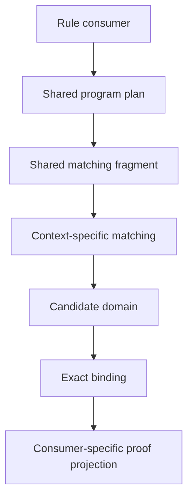

# Runtime performance roadmap

Execute the same rules and programs faster, preserving their behavior. Rule construction, reconstruction, changed-output specialization and automatic program rewriting are outside this work. Reuse of an internal matching plan, result allocation plan or flow template must implement the original rule unchanged, including its input, output, captures, resource identity and evidence. Execution order may change while preserving execution semantics and the public contract. Exact historical traversal order is not an independent optimization requirement.

## Current priority

The authorized [runtime occurrence migration](occurrence.md) replaces declaration availability with live rule occurrences and consolidates state transitions in one evaluator. Its semantics and complete-state targets now take precedence over older compatibility assumptions below. Rule contents and grammar are preserved. The old compiled scope masks and duplicate output evaluator have been deleted; their historical measurements describe the previous architecture.

The [incremental occurrence audit](invalidation.md) delivers localized context indexing, explicit visibility invalidation, owner-directed consumption, shared reachability results and an independent bounded transition oracle. Whole-index rebuilds and inherited-symbol expansion are removed. A generic persistent-sequence prototype and two lightweight subscription prototypes failed their latency gates and were removed. The [exhaustive replay audit](transcript.md) fixes recycled-site dependencies; its broader rule-sensitive prototype was also removed because complete-program execution did not improve. [Persistent occurrence populations](population.md) now separate immutable contents from live membership and maintain explicit fingerprint dependencies with an eviction fallback. The [demand-driven admission audit](admission.md) adds owner-local consumer groups and admits searches from their candidate domains once. Its paired matrix recovers the scope regression and improves six-factor execution about 14%, while small and wide consumption each slow about 3%. The subsequent [runtime review](review.md) replaces randomized hashing, sorted-set dispatch bookkeeping, repeated reachability scans and per-event collection rebuilding. Compact arithmetic runs about 1.7× faster, six-factor streaming export about 1.18× faster and small and wide consumption 1.67× and 1.27× faster, while execution allocation calls fall 28% with every observation unchanged. Broad identity scans, arithmetic allocation traffic and complete-history reporting remain. Preserve the occurrence semantics and require measured gains across initialization, ordinary execution, scope entry/retirement, consumption, memory and release.

Performance acceptance targets the current development machine. Preserve hermetic multiplatform builds and native/WebAssembly semantics; timing on additional machines is not a prerequisite. Robustness, scaling under larger workloads and ownership clarity are acceptance requirements alongside latency.

Scope corrected on 2026-09-21. The structural reference model and its construction, collection and reconstruction milestones have been removed. The pre-existing dynamic language proposal is archived separately and creates no implementation prerequisite. Existing production programs and rules are unchanged by this correction. The native captured-resource import fix and its regression test remain: converging imported resources retain one occurrence and the union of their provenance.

The [CPU continuation](continuation.md), delivered at `b820bc3`, already includes chunked persistent transcripts, completed exhaustive query replay, parameterized flow templates and large-search CPU admission. Preserve those improvements and do not queue them again. Earlier subscription/index allocation experiments failed their acceptance gates; a new experiment needs a distinct hypothesis and fresh measurements.

The latest reporting work is delivered: [inactive dispatch traversal](maintenance.md), [affected-group refinement](canonical.md), [canonical resource storage](resource.md), [shared report text](render.md), [compact canonical mappings](mapping.md), [shared canonical frames](preservation.md), and [demand-driven canonical refinement](normalization.md). The last slice preserves exact canonical ordering while omitting graph construction when leading ordering keys already resolve every group. Ordinary, scope and wide-consumption reporting improve about 44–45%; six-factor streaming export improves only about 2% because most of its states still need graph refinement. The [lifecycle benchmark](lifecycle.md) separates initialization, execution, full reporting, serialization and release; allocation diagnostics run separately from timing acceptance. Exact reports and native/WebAssembly semantics remain protected. Two subsequent [refinement experiments](experiment.md), earlier symmetry and resumable partition refinement, were removed because they did not improve the measured expression export. The later [shared-incidence increment](incidence.md) reuses the refinement graph during resource renaming, reducing six-factor streaming export about 17% and cumulative allocation about 21%, with every protected phase and control within its existing tolerance. Graph construction/refinement, execution-side identity scans and arithmetic allocation traffic remain. The subsequent [capture-dependency increment](dependency.md) shares immutable fingerprint graphs and maintains capture multiplicity from persistent population changes. Wide-consumption execution improves about 16%, with about 25% less execution allocation; six-factor execution allocation falls about 8% while latency stays flat. All final phase and control limits pass. Small scope/consumption allocation grows, and the distinct-capture scaling control costs about 9% more at submillisecond scale; rejected variants and initial control failures are retained in the audit. The [resource-bound increment](identity.md) subsequently derives bounds from owned-population changes. Consumption execution improves about 5.5% at 256 occurrences and 8.6% at 1,024 occurrences, with approximately unchanged allocation. Expression initialization costs about 4–5% more, close to the existing limit. The longer complete confirmation passes all phases and controls; rejected traversal interfaces and initial failures remain recorded. Color recomputation and complete-history reporting still dominate the larger fixture.

Shared report text reduces owned report storage from about 213 to 108 MB; Rust report text fields now use `Arc<str>`. Compact mappings subsequently reduce retained engine storage from about 169 to 150 MB. The latest [frame-sharing audit](preservation.md) lowers that to about 130 MB and peak requested storage from 392 to 372 MB. This costs about 2.4% in full-export latency (599 versus 613 ms), within the existing gate. A 64-level scope fixture retains 76% less engine memory. All 27 protected comparisons pass. Canonical worlds remain the largest attributed engine component, at about 64 MB before any world-sharing change; the measured hash-based world-sharing prototype regressed latency and was removed. The CLI already streams JSON to its writer; the benchmark's 134 MB encoded buffer is a separate concern for consumers that require an in-memory JSON value.

The latest [subscription-key audit](registry.md) removes redundant frame coordinates from frame-local registry trees. Final compact arithmetic medians improve about 1.7–2.0%, execution allocation traffic falls about 0.55 MB in the six-factor case, and all 42 protected comparisons pass. Full-export latency and peak storage are approximately unchanged. Subscription construction remains the main measured CPU opportunity.

The first [shared matching structure](plan.md) slice is delivered. A bound context now holds one immutable shape and an owner, removing per-subscription captured-pattern matrices and redundant ownership. Paired compact arithmetic improves about 1.3–3.3%; six-factor execution allocation calls fall 17.9% and allocation traffic falls 6.75 MB. All 42 protected comparisons pass. Admission counts and logical accounting remain unchanged, so subscription lifecycle work is still open.

The [report-view implementation](view.md) is also delivered across direct-path, exhaustive and prism JSON output. It serializes rendered history incrementally while retaining owned snapshot APIs. In the six-factor export benchmark, peak requested storage falls from 372 to 264 MB with an encoded buffer, and from 238 to 130 MB for a writer. Export latency is approximately flat. All 22 export comparisons pass; compact execution remains approximately unchanged.

The [subscription activation audit](activation.md) now distinguishes membership from enumeration. Of 66,492 admissions, 56,606 initially have an empty candidate domain, and 53,307 removals occur while the input is globally disabled but its frame still exists. The first slice defers enumeration cursors for empty domains. Compact arithmetic improves about 0.7–3.3%, with unchanged logical accounting and admission counts. Boxing active cursors increases execution allocation traffic about 2.2%; peak storage is approximately unchanged. This modest slice does not replace the larger membership-maintenance project. Empty particle slots match distinct actual coherences. The later occurrence contract distinguishes zero positions (`[]`) from one empty particle position (`[()]`); read this historical audit under that superseding contract.

The [compiled scope membership audit](scope.md) replaced per-scope hash lookup and ordered availability sets with flat declaration groups and hierarchical availability masks at fixed local positions; the occurrence migration later deleted those masks. At that stage, wide and heavily shared synthetic scope workloads improved index/dispatch lifecycle time about 2–5.4×, and sparse enumeration skipped inactive mask words. Those timings excluded fixture construction and were not whole-program speedups. Arithmetic remained approximately flat. The changing-prefix control was about 4.6% slower in its longer follow-up, within the existing 5% gate. All 42 protected comparisons and eight scope lifecycle comparisons passed, with raw failures and follow-ups retained. Search admission counts were unchanged.

The [join location audit](location.md) now separates stable sites inside matching from current world positions at delivery using distinct slot types. This tightens the boundary needed for future reuse without changing enumeration or subscription lifecycle. All 110 test targets and 82 exact reports pass; no overall speedup is claimed.

The [subscription retention experiment](subscription.md) rejects whole-search parking with eager maintenance. A 128-entry policy has 48,764 potential hits in the six-factor trace but adds 426,099 maintenance calls; the actual prototype regresses four complete expression workloads about 83–93% and has been removed. Priority 1 now requires separating lightweight membership from materialized candidate state, rather than maintaining every inactive query. A high hit count is not sufficient evidence of benefit.

The [empty search representation experiment](dormancy.md) also rejects a compact wrapper around initially empty joins. Boxing active joins regresses the six-factor case about 7.1%; the inline alternative changes timings by less than 1.5% with negligible allocation differences. Both were removed, while differential replay and activation coverage was retained. Further lifecycle work needs construction-cost attribution, not another layout variant inferred from admission counts.

No new language capability or collection demonstration is required. Each optimization must justify its maintenance cost with repeatable complete-program benefit. Stop when latency and memory meet the workload's needs; the research list is optional.

The [architectural opportunity assessment](opportunity.md) now governs selection. Prefer changes that remove repeated setup, materialization or maintenance across a whole layer. Attribution is part of each architectural experiment, not a separate open-ended optimization project. Small allocation changes remain optional when their benefit is clear; the latest direct-collection probe was removed after mixed results.

| Priority | Work | Value and initial effort | Acceptance gate |
| --- | --- | --- | --- |
| 1 | Extend demand-driven subscription maintenance only where repeated work remains measured | Owner-local membership and exact candidate admission are delivered. Dispatch still reconstructs request lists and attempts absent local domains; broad retention of inactive searches was rejected | Attribute remaining repeated requests and failed admissions; preserve late activation, evidence, invalidation, limits and suspension; substantial new machinery should target at least 10% lower complete execution latency |
| 2 | Shared maintained interior relations across independent queries | Largest conditional scaling opportunity under repeated joins; 1–2 weeks to establish demand, 4–8 weeks for one integrated join family | Two actual consumers save more than discovery, storage, invalidation and private delivery cost; scale consumer count and mutation density through cold, warm, changed and evicted cases |
| 3 | Lazy parent-trace composition and continuation checkpoints | Remove repeated composition work on long traces; 2–4 weeks for a bounded implementation | Include complete delivery and release cost; every paused prefix resumes with identical bindings, evidence and contractual accounting |

These are planning estimates and experiment targets, not delivery promises or measured speedups. The report-view milestone is delivered. Priority 1 serves execution; priorities 2–3 require workload evidence. This is not an unconditional sequence. A simple ownership improvement can be valuable without a large speedup, while complicated new reuse must justify its maintenance cost. Full-report improvements must not be presented as compact execution speedups. Native requested-byte counters are not process memory or WebAssembly heap measurements. Caches must track exact dependencies, capture/context identity and occurrence generation; stale or incomplete entries fall back to exact evaluation. Negative results require complete search or an established sound exclusion check.

The registry audit measures about 41 ms in dispatch, 13 ms in indexing and 2 ms in matching within a 72 ms instrumented expression run. Nested scopes overlap; subscription reconciliation accounts for about 27 ms inside dispatch, including roughly 10 ms of query preparation. Halving subscription work alone would hypothetically reduce total latency about 19%, or yield about 1.23× serial throughput; eliminating matching would save only about 3%. These are diagnostic Amdahl estimates, not forecasts. Restart accounts for only about 0.24 ms, so a persistent agenda alone is not the next major project.

Before the shared-structure change, the count-only diagnostic recorded 66,492 search admissions using 2,110 distinct frame/input/owner coordinate combinations, with 37,027 admissions constructing captured patterns. Those bound matrices are now eliminated from live subscriptions. Repeated coordinates can refer to changed or recycled live contexts and do not authorize reusing old search results. The latest separate paired profile still records 66,492 admissions, with about 37 ms in dispatch and 24 ms in subscription work. Use lifecycle evidence to select the next coherent-maintenance slice; see the assessment and implementation audit for code boundaries and rejected precedents.

## Conditional research

Potential novelty lies in preserving Photonic's resource, evidence and exact suspension contracts while avoiding repeated evaluator work. No research originality or speedup is claimed. Select at most one experiment after profiling; stop if its overhead exceeds the saved work.

| Experiment | Initial budget | Continue only when |
| --- | --- | --- |
| Certified negative matching spans | 1–2 weeks | A restricted suffix counter proves the exact logical waiting length, tracks invalidation and reconstructs every interrupted continuation more cheaply than traversal |
| Stronger internal canonicalization | 1–2 week prototype; 3–6 weeks for a restricted implementation | Symmetric-state workloads improve end to end, exact identity mappings agree with the oracle, and small states do not regress |
| Lossless causal evidence compression | 2–3 weeks for an argument and prototype; integration remains highly uncertain | Every required state, event, read, capture, flow, support and suspended observation is reconstructible with lower total storage and acceptable reporting cost |

Certified spans extend the question in [certificate.md](certificate.md); completed transcript replay does not establish first-visit skipping. Compression does not authorize dropping observable derivations or changing program rules. General pruning, GPU execution and broader parallel redesign remain deferred until a representative workload and a preservation argument justify them. Independent certificate export is a separate verification feature, not a speed milestone.

## Runtime implementation history

The first production implementation and its remaining boundaries are tracked in [implementation.md](implementation.md). The subsequent [factorization audit](factorization.md) records retained leaf bindings, adaptive intersections, and cyclic reachability. The subsequent [architecture audit](architecture.md) adds localized domain updates, incremental grounded support, and explicit proof-store ownership. Read these historical boundaries together with the latest continuation audit and the current sharing table below.

The target is an evaluator that shares reusable program structure, discovers concrete work on demand, and maintains derived results from explicit changes. Decisions are conditional on semantic equivalence and measured benefit. No universal speedup or globally optimal query plan is assumed.

The [joined-prefix implementation](prefix.md) now retains bounded multi-input prefixes across suffix-only changes and gates admission on observed reuse. It preserves exact pending/binding streams and falls back to direct traversal under prefix churn. The [sharing implementation](sharing.md) adds completed prefix transcripts across distinct direct-dispatch plans, bounded canonical environment reuse and immutable identity flow sharing. Interior fragment retraction is described in the later interior audit; arbitrary row-level maintenance and exhaustive subquery sharing remain unfinished.

The [candidate-domain implementation](candidate.md) shares presence filters and dependency summaries across distinct plans, maintains complete candidate snapshots across verified deltas, and supports late activation with exact fallback. Query-local occurrence arrays and mutable particle cursors remain private. Later stages add retained joined fragments and completed exhaustive replay; cross-plan maintained interior relations remain open.

The [dispatch dependency audit](dispatch.md) now removes repeated lexical-ancestor walks within each update and transient activation during coherent symbol changes. Detailed profiling showed agenda restart was a small part of arithmetic dispatch cost, so the existing progress-preserving restart remains. The subsequent [partition audit](partition.md) implements the first bounded joined-fragment maintenance slice. A persistent agenda remains unimplemented; the later [reconciliation audit](reconciliation.md) adds an incremental reverse lexical dependency index. The subsequent [interior matching audit](interior.md) extends retraction below the first input, adds immutable unfinished prefix snapshots and removes the inherited prefix regression through a cheaper symmetry check. The [CPU research review](research.md) gives the next priorities and updated primary sources.

## Semantic boundary

The user has now authorized the [runtime occurrence migration](occurrence.md), following the earlier [loading assessment](loading.md). This is a language migration with explicit changes to loading, visibility, ownership, and zero-input execution. It remains separate from performance optimization and preserves rule definitions. The implementation and semantic regression matrix take priority over additional performance experiments.

- State is unordered. Synchronization establishes a firing; planner order and scheduler order are implementation details.
- Bindings retain resource occurrence identity, multiplicity, distinct-world constraints, captures, lexical ownership, and executable-rule read dependencies.
- Sharing a description never merges live occurrences or makes evidence from competing histories jointly available.
- Every successful optimized operation reconstructs the exact binding, state change, and provenance required by the existing evaluator.
- A summary can reject a match only when it conservatively covers every concrete candidate in the relevant context. Passing the summary establishes a possibility, not a proof.
- Failure to match a current snapshot is not proof of permanent unreachability. Incomplete or suspended enumeration is never cached as absence.
- Inspectable history, support, reporting, resource limits, and suspension behavior remain part of the compatibility contract. A different cache footprint or traversal must not silently alter that contract.
- Arithmetic receives no special treatment. Frontend syntax, browser defaults, and existing program behavior are preserved by optimization.

Before changing scheduling or accounting, distinguish contractual observations from incidental traversal order. Execution order may change, but required results, provenance, resource limits, inspection and resumability must retain their contract. Exact historical trace comparisons remain useful regression checks for representation-only changes; a scheduling experiment needs checks of the permitted order changes as well as the unchanged semantics. A mathematical proof of final-result equivalence alone does not establish compatibility with a bounded, inspectable runtime.

## Current sharing and remaining gap

| Layer | Existing implementation | Remaining work |
| --- | --- | --- |
| Code | `program.rs` interns complete rule values | Discover reusable internal structure without identifying executable occurrences |
| Input | `catalog.rs` shares complete inputs and immutable particles; `joining/store.rs` shares exact complete and unfinished prefix snapshots between direct plans | Discover additional reusable internal subplans |
| Context | Capture-sensitive prefix keys, capture-free input identity and bounded weak reuse of canonical environments | Broader context-specific matching reuse with explicit dependencies |
| Candidate | Shared exact filters, dependency summaries, eligible insertions, and incremental candidate snapshots in `candidate/`; indexed eligibility and bounded shared immutable preparation | Share consumer occurrence storage; immutable exhaustive preparation is now shared |
| Binding | Bounded replay, surviving leaf factors, projected multilevel fragments, shared unfinished snapshots, persistent binding payloads and chunked record transcripts | Cross-plan partitions, lazy parent-trace composition and efficient continuation checkpoints |
| Proof query | `runtime/table.rs` shares exact queries; `selection/` shares captured preparation; `gate/` reuses abstract assignment decisions; `search/` replays completed exact query transcripts | Maintain interior multi-particle query fragments while preserving consumer-specific gates and projection; scheduler-aware waiting-span batching |
| Transition | `evaluation.rs` applies original instructions for direct and exhaustive exploration | Reduce context maintenance and allocation while preserving occurrence consumption and provenance |
| History | Persistent state, exact provenance, incremental capture reachability, grounded support, nonidentity union reuse and parameterized flow templates | Exact flow reuse and lossless evidence representation |

The direct path and exhaustive backward runtime have different responsibilities. Shared primitives can serve both, but migrating the exhaustive runtime cannot remove source inference or proof projection. Its separate algorithms are useful reference behavior, although some underlying storage and indexing are already shared.

## Sharing from abstraction to instance

Use a graph of reusable computations with explicit interfaces. A source-level abstraction is a discovery hint, not a sufficient cache key: lexical nesting and similar names do not establish semantic equivalence. Within a compiled matching plan, shared fragments form a directed acyclic graph. Recursive proof dependencies require separate strongly connected components and fixed-point processing.

Demand travels from rule consumers toward the data needed by their plans. Changes travel from concrete data toward the affected derived computations. Neither direction imposes an execution order on Photonic firings.

The first implementation discovers exact reuse. Intern identical operators with their child identity and parameter interface. Index symbol and multiplicity signatures to find candidate common fragments, then verify equality exactly. Search a bounded set of fragments already exposed by rule structure or observed reuse; do not enumerate every subset of every input. Any normalization of unordered structure must retain the permutation needed to restore existing input-position and reporting behavior.

As an illustration, two plans that each require separate worlds containing `A` and `B`, followed by different requirements `C` and `D`, may share the `A`/`B` fragment in the same compatible context. Extension must still check that the third world is distinct, that resource multiplicity is valid, and that each consumer's evidence is compatible. Sharing the fragment does not share the entire proof.

Internal matching plans may share structurally equal computations with explicit parameters. Exact checks must retain every original constant and capture requirement. This sharing cannot change rule inputs, outputs or executable occurrences.

Use these cache boundaries:

| Layer | Reusable value | Validity boundary |
| --- | --- | --- |
| Program | Immutable exact plan and recipe | Program identity and verified structural identity |
| Summary | Conservative symbol, count, shape, and scope information | Snapshot or explicitly maintained dependency version |
| Context | Matching plan keyed by its environment | Required ownership, capture, visibility, and boundary mapping |
| Domain | Candidate occurrence and prepared particle match | Context plus site/resource generation and exact dependency |
| Binding | Factorized partial result and enumeration frontier | All contributing domains, residual constraints, and consumer position mapping |
| Proof | Shared exact derivation or flow template | Exact source evidence, read support, capture mapping, and fresh identity substitution |

Global immutable plans must never embed a live frame or resource identity. Initially use explicit conservative context keys. Reduce the key only after proving that omitted context cannot affect the value; arbitrary whole-state equivalence or unrestricted query containment is not a practical lookup operation.

Sound summaries can avoid expensive refinement. For example, insufficient possible resource occurrences can rule out a current binding before token enumeration. Counts must conservatively account for sharing, alternative histories, capture eligibility, and world boundaries. Unknown or stale summaries fall through to exact evaluation. Negative results require a complete relevant search or a sound exclusion certificate and are invalidated on relevant changes.

Demand must include every consumer required by the existing execution mode. In exhaustive mode, it cannot mean only the user's final expression or a favored proof branch. A suspended shared computation must retain enough state for every subscriber to receive its own complete result stream without duplication or starvation.

## Incremental partial matching

Replace whole-stream invalidation incrementally, with the current exact traversal available during development:

1. Represent a reusable partial binding with explicit consumed occurrence, read dependency, capture dependency, and remaining constraint.
2. Maintain reverse dependencies from changed sites and context components to affected fragments. Version reusable slots so a new occurrence cannot revive an old binding.
3. Apply each rewrite's removals and insertions as one coherent delta relative to a snapshot. Do not expose partially updated indexes or mixed versions to a consumer.
4. Preserve unaffected fragments. Extend inserted candidates against compatible retained fragments; retract only unsupported results. Handle simultaneous changes to several inputs without duplicate derivations.
5. Keep result multiplicity and evidence distinct. A support count can maintain existence, but it cannot replace the identity of competing derivations or consumed resources.
6. Enumerate products lazily with independent consumer cursors. Retain continuation state when a prefix is only partially explored.
7. Bound retained state globally as well as locally. Eviction discards recomputable acceleration data, preserving required continuation and proof data. It never truncates answers.

Cache admission uses measured reuse, construction cost, update rate, fanout, retained bytes, and logical records. Small or frequently changing queries can use direct traversal. Introduce deterministic policy and hysteresis before attempting sophisticated online tuning. Compare discovery and maintenance overhead against saved work, including consumers that stop early.

The desired cost follows the changed dependency region plus newly demanded results. This is a workload-sensitive objective, not a bound that defeats combinatorial output size. If an update invalidates nearly every result, broad recomputation may be optimal.

## Ownership and API design

Move related state and its invariants into an owning component rather than adding more files containing methods on the same large `Runtime`.

| Responsibility | Owns | Boundary |
| --- | --- | --- |
| Model | Program meaning and exact state | No scheduler, cache, or reporting dependency |
| Storage | Persistent representation and allocation | Stable identity distinct from physical position |
| Index | Derived lookup and graph metadata | Applies validated state changes |
| Matching | Plan, domain, subscription, cursor, and reuse | Emits exact bindings; does not construct proof state |
| Rewrite | Binding application and construction | Emits state, change, and required provenance |
| Proof | Flow, evidence, support, and history | Preserves competing derivations |
| Runtime | Agenda, suspension, limits, coordination | Composes components through explicit operations |
| Report | Inspection and external representation | Reads a consistent snapshot |

Matching subscription/cache/cursor ownership, proof normalization, and grounded evidence now have dedicated stores. Continue tightening identity and flow ownership at those boundaries. Keep accounting with the structure it measures, using one consistent aggregate interface; avoid independently maintained duplicate totals.

Use distinct identity newtypes where interchange is invalid, with unabbreviated namespace-based naming such as `frame::Identity` and `resource::Identity`. A live stable site, a historical occurrence, and a current ordinal are different concepts. Use generation checks where reuse is possible; never expose arena placement as semantic identity.

Replace positional argument groups with a named request when they describe one operation, particularly rewrite source/context/binding. Validate a binding against its snapshot at the boundary before applying it. Use concrete structs and enums, private fields, early returns, immutable plans, and exclusively owned mutable cursors. Introduce a trait only for a real substitution point. `Option`, `Result`, and `Poll` represent absence, failure, and cooperative progress respectively.

Keep identifiers singular, one word, and unabbreviated. Put explanations and invariants in design documents. Remove dead paths after equivalence and performance acceptance; retain a deliberately small test oracle rather than a permanent duplicate production framework.

Use explicit Bazel source lists and narrow visibility. Introduce crate boundaries only at stable ownership boundaries where dependency enforcement and incremental rebuild behavior justify them. Avoid a crate per file. Preserve hermetic native and WebAssembly builds with Bazel as the only system build prerequisite.

## Incremental evaluation stages

This table retains the original runtime decomposition and its acceptance gates. It is not a fresh sequential backlog: substantial portions have shipped, as described below. The current priority section governs the next work; remaining runtime stages are selected by workload evidence.

| Stage | Work | Acceptance gate |
| --- | --- | --- |
| 0 | Record observables, benchmark manifest, and phase counters | Reproduce current arithmetic regression and matching gains on an isolated revision |
| 1 | Extract matching and normalization ownership; tighten identity and request APIs | Exact existing snapshots and suspension behavior; no meaningful end-to-end regression |
| 2 | Compile a shared exact fragment graph; retain consumer projections | Work saved across different rules, with bounded discovery cost and identical binding/proof multiplicity |
| 3 | Add conservative summaries and demanded context-specific matching | No false rejection; complete exhaustive demand; cold and low-reuse workloads remain competitive |
| 4 | Maintain bounded factorized partial matches under deltas | Insert/delete/reuse/pause sequences agree with fresh exhaustive enumeration; bounded retained memory |
| 5 | Add adaptive intersection, residual assignment filtering, and safe decomposition | Benefit on skewed/wide constraints without regressions on simple matching |
| 6 | Localize posting removal, reachability, fingerprint, and rewrite construction work | Exact full recomputation agrees through cyclic frame and capture mutation |
| 7 | Share flow composition and proof support; reuse exact result allocation plans | Full backward-inference and competing-evidence equivalence, including recursive support |
| 8 | Develop compact causal history and an independence relation | Reconstruct all required observations; reduction only with a suitable equivalence argument |
| 9 | Evaluate generic instruction fusion and parallel execution | Preserve synchronization, logical accounting, and inspection; measured native and browser benefit |

Current acceptance state: stage 2 includes shared complete and unfinished prefix snapshots and exact candidate-filter nodes; stage 3 includes conservative dependency summaries; stage 4 includes candidate membership maintenance and projected joined fragments at adaptively retained interior depths. Reverse dependencies cover relevant ancestor occurrences and the anchor, while each layer explicitly invalidates changed searched-domain intervals. Exact progress, slot reuse, bounded storage, saturation, producer/follower interleavings and eviction restoration are covered by differential tests. The later interior audit resolves the inherited protected prefix regression using transitive symmetry checking.

The [preparation audit](preparation.md) implements bounded sharing of immutable particle preparation with private cursors and occurrence-native candidate lookup. The [multilevel audit](hierarchy.md) adds projected ancestor context and a bounded per-join forest. Short reusable fragments can retain several depths; longer fragments retain a cheaper single-depth representation. The [CPU checkpoint](cpu.md) adds persistent child links for binding payloads, and the [continuation](continuation.md) adds chunked persistent record transcripts. Parent extension still constructs record headers and prefix links; lazy composition and cross-plan partition sharing remain open. Unfinished snapshots do not share a mutable producer, and exhaustive proof projection remains separate.

The [capacity rejection audit](residual.md) rejects insufficient token multiplicity before allocation without skipping candidate visits. General residual assignment filtering remains open. The [exhaustive preparation audit](exhaustive.md) adds bounded captured-pattern interning and immutable preparation sharing, retaining private gates and proof projection. The [batching audit](batch.md) implements exact consumption of cached direct-path waiting spans, preserving scalar observation and budget boundaries. The [parallelism audit](parallel.md) measures small exhaustive fixtures, which favor one worker; the CPU checkpoint and continuation add conservative admission for large normalization and search work. Completed exhaustive query replay and parameterized flow templates are delivered. Broader maintained interior queries, exact result allocation reuse and further subscription/index changes require their own measured gates. GPU remains deferred.

Stages 2 through 4 are the first major algorithmic milestone. Stages 5 and 6 can change priority according to measured bottlenecks. Stages 8 and 9 are conditional research tracks, not promises that an implementation must contain these techniques to be complete.

The initial runtime sequence established the semantic/performance harness, ownership boundaries, shared planning, conservative context reuse and maintained fragments. Expand supported operators only after each new vertical slice passes its gates. Keep changes separately measurable so refactoring and algorithmic gains can be distinguished.

Keep compiled matching plans separate from executable occurrences. Existing programs may emit or consume executable occurrences as part of their specified behavior; optimizations must preserve that behavior. New rule construction, reconstruction, output replacement and automatic program rewriting are outside this roadmap.

## Verification and measurement

Use differential, generated, and metamorphic tests at stable boundaries. Compare full binding multisets and provenance, not only final arithmetic answers. The direct and exhaustive engines are compared only on their common semantic domain; backward inference also needs its own reference cases.

Required adversarial coverage includes unordered permutations, administrative renaming, duplicate values with distinct identity, reused slots, captured equal code, competing histories, executable read dependencies, empty inputs, wide gates, interrupted enumeration, cyclic reachability, cyclic unsupported evidence, fingerprint collisions, simultaneous insertion/deletion, cache eviction, new subscribers, and exhaustion immediately around a delivery. Abstract filters must be checked against exact candidate enumeration.

### Metaprogramming and recursion

Deep metaprogramming is a release gate for optimization, not an optional benchmark. The requirement is zero known semantic regressions. Testing cannot establish the absence of all kernel bugs; combine independent expected results, bounded exhaustive comparison, invariant checks, and an explicit preservation argument for every new sharing or pruning rule. A disagreement blocks acceptance and must be minimized into a permanent regression case before continuing.

Preserve the existing capabilities when reporting coverage:

| Capability | Current boundary | Test commitment |
| --- | --- | --- |
| Deep rules about rules | Complete nested rule values and whole-rule matching exist | Generate depth families that execute and transform nested rule values, preserving level, multiplicity, and capture |
| Runtime rule occurrence production | A firing can emit executable code whose shape was compiled from the source | Exercise delayed activation, repeated production, replacement, consumption, and local execution |

Existing reference cases in `language/test/reference.json` cover whole-rule replacement, generated rule execution and nested bodies, escaped local definitions, competing code/data histories, and persistence of earlier results after code consumption. `language/test/support.rs` covers unsupported self-cycles and a seeded cycle. These provide anchors, but do not establish systematic deep coverage. The examples in `program/language/dynamic.wave`, `replacement.wave`, and `capture.wave` are executable fixtures, not evidence that every planned scenario is already tested.

Build the following matrix before enabling new shared matching behavior:

| Family | Required observation |
| --- | --- |
| Nested execution | Rules emit rules that emit rules; the intended leaf becomes executable only through the required firings |
| Nested matching | A meta-rule matches a complete nested rule; a near-identical value with a different inner input, output, multiplicity, or body must not match |
| Deep capture | Equal code escapes distinct nested environments; each invocation retains its own lexical behavior through frame reclamation and reuse |
| Shared description | Equal syntax can share storage while separate executable occurrences and their evidence remain distinct |
| Delayed generation | A query initially has no matching executable occurrence; later production wakes it and invalidates any cached negative result |
| Replacement and consumption | Replacing or consuming code changes future availability without deleting earlier results supported by valid reads |
| Competing production | Code from one incompatible history cannot execute on data from another, including when both share a high-level plan |
| Repeated generation | A finite program repeatedly produces fresh occurrences; cache and catalog growth do not merge them or impose an accidental lifetime cap |
| Recursive execution | Seeded direct and mutual recursive behavior follows the existing cycle, support, and limit semantics |
| Circular evidence | Self-support and mutually circular support without a grounding derivation establish no proof |
| Suspension | Pausing during generation, matching, activation, or projection and then resuming agrees with uninterrupted execution |
| Resource pressure | Eviction, tight limits, and slot reuse preserve evidence and report exhaustion through the existing contract |

Recursion in execution does not require a rule's syntax to contain itself. Initially express recursion through existing rules, captured definitions, or repeated generation. Cyclic code values are a separate representation and semantic question, not a prerequisite. Do not add a fixed-point operator or new reflective syntax merely to exercise recursive execution.

Generate families with depth, branching, capture count, and production count varied independently. Include depth 1, 2, 3, 8, 16, and 32 where admitted by existing resource limits, then use a separate stress sweep to discover practical boundaries. Begin with linear-size construction so exponentially growing source does not confound evaluator depth. Exercise parsing, compilation, matching, rewriting, canonicalization, reporting, and destruction; a runtime-only test can miss recursive stack failure elsewhere. Supported inputs must execute correctly, and larger inputs must not acquire an undocumented new semantic depth restriction from the optimization.

Use hand-specified positive and forbidden results for small cases, full proof and binding comparison against a simple reference on tractable cases, and metamorphic renaming/permutation checks for larger cases. Test fresh and shared execution with cold, warm, invalidated, and evicted caches. Check derivation multiplicity and capture provenance as well as reachable labels. Agreement between two paths that share a faulty index is insufficient, so include direct enumeration and targeted invariants at that boundary. Run through native Bazel tests and browser conformance without changing expected records to accommodate a discrepancy.

### Performance acceptance

Measurements include existing arithmetic and expression programs, shared complete plans, shared fragments across different plans, many contexts with equal shape and different captures, disjoint plans with no reuse, high update rates, skewed domains, combinatorial products, frame churn, deep proof composition, and recursive proof support. Vary program size, sharing ratio, context count, and mutation density independently.

Measure initialization, execution, reporting, release, peak bytes, retained logical records, actual transitions, candidate preparation, invalidated fragments, cache admissions, and cache reuse. Keep timers/counters out of hot paths when disabled. Use sequential paired optimized native Bazel runs with adequate warmup and enough samples to report dispersion; also measure cold execution and WebAssembly. Do not run competing builds during timings.

Record the exact source revision and configuration. Select explicit regression tolerances from observed benchmark noise before evaluating a candidate. Require repeatable end-to-end improvement on the targeted workload and no unexplained regression beyond those tolerances on the protected workload set. Report failure and memory growth, not just successful medians. Preserve raw samples and reproduction commands.

Before accepting a production stage, run the full Bazel test suite, formatting and lint checks, native/browser conformance, and relevant platform CI. Historical test results in `optimization.md` are not validation of a new change. Documentation-only planning does not require rerunning the runtime suite.

## Research basis

The implementation recommendation combines established techniques with current query-engine work. These sources provide algorithms and design precedents; none establishes Photonic equivalence automatically.

- [Top-down and Bottom-up Evaluation Procedurally Integrated](https://arxiv.org/abs/1804.08443): subsumptive tabling with abstraction provides a close analogue for demanded general computations reused by specific queries.
- [SWI-Prolog subsumptive tabling](https://www.swi-prolog.org/pldoc/man?section=tabling-subsumptive) and [incremental tabling](https://www.swi-prolog.org/pldoc/man?section=tabling-incremental): practical distinctions between query reuse and dependency maintenance. Photonic must retain its own resource and evidence rules.
- [Abstract interpretation](https://www.di.ens.fr/~cousot/COUSOTpapers/POPL77.shtml): sound approximation motivates summaries that conservatively filter concrete work. The proposed initial filters do not require a general abstract interpreter.
- [DBSP](https://docs.feldera.com/vldb23.pdf): compositional incremental maintenance, including multiset and recursive computations, informs delta propagation.
- [Free Join](https://arxiv.org/abs/2301.10841): supports adaptive planning across traditional and worst-case-optimal joins rather than a universal algorithm replacement.
- [FlowLog](https://arxiv.org/abs/2511.00865): separation of recursive control and relational plans informs ownership and subplan reuse.
- [Maintaining Queries under Updates Using Heavy-Light Partitioning](https://arxiv.org/abs/2605.08397): a 2026 research candidate for skew-aware maintenance after simpler delta planning is measured.
- [Unfolding-based Partial Order Reduction](https://arxiv.org/abs/1507.00980): motivates the later causal track, subject to a Photonic-specific independence relation and observation-preservation argument.

The [subscription reconciliation audit](reconciliation.md) adds frame-local ordered subscription storage and incremental lexical descendant discovery, with a record-accounted eviction fallback. Its full native matrix and differential checks preserve progress and proof observations.

The [CPU checkpoint](cpu.md) implements bounded exact assignment decisions beneath exhaustive consumers, persistent binding payloads, nonidentity provenance-union reuse and large-task CPU admission. It also adds a pinned historical differential oracle. General residual pruning and causal-history reduction remain explicit equivalence research; they are not enabled by this checkpoint.

The [CPU continuation](continuation.md) adds chunked persistent trace records, completed exhaustive transcript reuse across exact candidate projections, parameterized flow templates and conservative large-search CPU admission. It records the rejected subscription-allocation experiments and fresh integrated measurements. The [certificate investigation](certificate.md) defines the remaining residual-pruning and causal-history obligations; arbitrary interior query sharing and lazy parent-trace composition remain distinct work.
